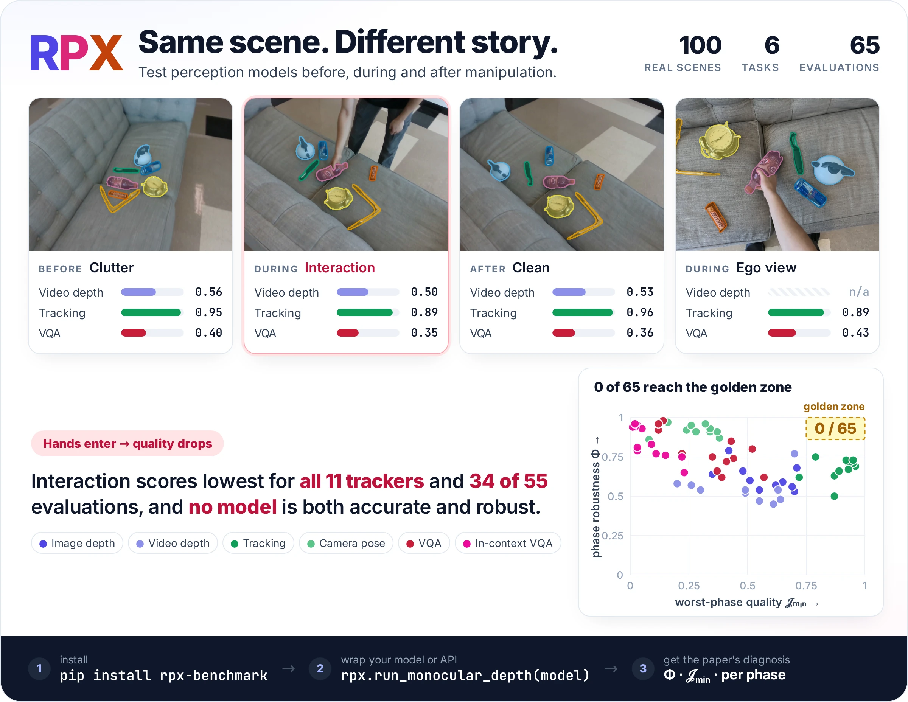

<p align="center">
  
</p>

<p align="center">
  <a href="https://pypi.org/project/rpx-benchmark/"></a>
  <a href="https://github.com/IRVLUTD/RPX/actions/workflows/tests.yml"></a>
  <a href="https://irvlutd.github.io/RPX/toolkit-docs/"></a>
  <a href="https://huggingface.co/datasets/IRVLUTD/RPX"></a>
  <a href="https://hub.docker.com/r/irvlutd/rpx"></a>
  <a href="LICENSE"></a>
</p>

<p align="center">
  <b>Same Scene, Different Story: Evaluating Robot Perception Across Scene Phases in the Wild</b><br/>
  A real-world benchmark that scores perception models on the same scenes before, during and after manipulation.
</p>

<p align="center">
  <a href="https://huggingface.co/datasets/IRVLUTD/RPX"><b>Dataset</b></a> ·
  <a href="https://irvlutd.github.io/RPX/toolkit-docs/"><b>Toolkit docs</b></a> ·
  <a href="https://pypi.org/project/rpx-benchmark/"><b>PyPI</b></a> ·
  <a href="docker/README.md#which-image-to-pull"><b>Model images</b></a> ·
  <a href="#citation"><b>Cite</b></a>
</p>

---

## Why RPX?

Robots act in scenes that change while they work: a table starts cluttered, a hand rearranges it, and it ends tidy.
Perception benchmarks usually score each task on its own static images, so they cannot tell you which model keeps
working when that happens. RPX can.

- **Same scenes, every task**: 100 real scenes (50 indoor, 50 outdoor) and 70 objects, scored on six tasks: image and video depth, multi-object tracking, relative camera pose, VQA grounding and in-context VQA.
- **Before, during, after**: Every scene is recorded in its Clutter, Interaction and Clean phases with RGB-D, stereo and pose, plus an egocentric view during Interaction: ~133K annotated frames.
- **Two numbers per model**: **Φ** measures phase robustness and **𝒥<sub>min</sub>** measures quality in the worst phase. None of the 65 evaluations in the paper reaches both 𝒥<sub>min</sub> ≥ 0.75 and Φ ≥ 0.86.
- **Your model in minutes**: Wrap a function or an API call; the toolkit applies the paper's data, splits and metrics.

### What RPX reveals

The same scene, scored before, during and after manipulation: quality drops when hands enter, and no model in the
paper is both accurate and robust.

<p align="center">
  <picture>
    <source media="(prefers-color-scheme: dark)" srcset="benchmark/rpx_benchmark/guides/assets/rpx-hero-dark.webp">
    
  </picture>
</p>

## Quick start

```bash
pip install 'rpx-benchmark[hub,schemas]'
python -m rpx_benchmark.examples.benchmark_tasks --task all --smoke --output rpx-check
```

That checks all six evaluators on synthetic inputs in about a second. To score your own model on real RPX scenes,
follow the [three-step example](benchmark/README.md#score-your-own-model-on-real-rpx-scenes): about 160 MB and under a
minute for a first result.

| I want to… | Go to |
|---|---|
| Score my model or API | [Bring your own model](benchmark/README.md#bring-your-own-model) |
| Run the paper's reference models | [Reference models](benchmark/README.md#reference-models) and the [Docker images](docker/README.md#which-image-to-pull) |
| Score a vision-language model on VQA | [Custom VQA model or API](benchmark/README.md#custom-vqa-model-or-api) |
| Explore the data | [Dataset card](https://huggingface.co/datasets/IRVLUTD/RPX) and [data contracts](https://irvlutd.github.io/RPX/toolkit-docs/data/) |
| Compute Φ and 𝒥<sub>min</sub> from my results | [Φ and JEDI calculator](https://irvlutd.github.io/RPX/toolkit-docs/analysis/) |
| Contribute to the toolkit | [Testing](benchmark/README.md#testing) |

## How RPX was made

```text
   CAPTURE                        ANNOTATE                          BENCHMARK
   D435 RGB-D + T265 pose,     →  SAM2 masks with human          →  load → run your model → score,
   head-mounted GoPro;            correction; one identity per       then Φ and 𝒥min per model
   Clutter · Interaction · Clean  object across phases and views

   data/capture/                  data/mask_annotation/              benchmark/   ← start here
```

| Folder | What it holds |
|---|---|
| [`benchmark/`](benchmark/README.md) | The `rpx-benchmark` package: loaders, task runners, metrics, Φ/JEDI, examples and tests |
| [`docker/`](docker/README.md) | Reproducible environments for every reference model |
| [`data/capture/`](data/capture/README.md) | Sensor capture tools |
| [`data/mask_annotation/`](data/mask_annotation/README.md) | Mask, grounding and VQA annotation tools |
| [`tracking/metadata/`](tracking/metadata/) | Versioned text prompts for text-initialized tracking |
| [`tools/`](tools/) | Dataset release, QA and documentation builders |

<details>
<summary><b>Terms used in RPX</b></summary>

| Term | Meaning |
|---|---|
| **Phase** | One recording of a scene: Clutter (before manipulation), Interaction (hands moving objects) or Clean (after). The egocentric view is recorded during Interaction |
| **MOS / SOS / Ego** | Multi-object scenes; single-object scans (each object alone, 360°); the head-mounted egocentric stream |
| **𝒥 and 𝒥<sub>min</sub>** | Quality on a common 0–1 scale: each metric is mapped to a desirability, combined per scene and phase, and averaged. 𝒥<sub>min</sub> is the worst phase's quality |
| **Φ** | Phase robustness, 1 minus the phase effect size from a repeated-measures analysis. High Φ means a model behaves the same across phases, not that it is accurate |
| **Easy / Medium / Hard** | Difficulty tiers of 33, 33 and 34 scenes, stratified by how much correction the scene's masks needed |
| **Manifest** | A JSON list of the samples a task evaluates; the loader reads it, you rarely write one |
| **Revision** | The dataset commit a run used. The toolkit pins one by default so runs stay comparable |

</details>

## Contributing

Run the [checks](benchmark/README.md#testing) before submitting changes. The offline tests never download checkpoints;
real-model checks run through the GPU gates in [`docker/`](docker/README.md). Capture and annotation-UI changes need
the corresponding hardware.

## Citation

```bibtex
@misc{rpx2026,
  title  = {Same Scene, Different Story: Evaluating Robot Perception Across Scene Phases in the Wild},
  author = {{Jishnu Jaykumar P} and Kadosh, Itay and Vijayakumar, Narendhiran and Kamath, Srinanditha and
            Allu, Sai Haneesh and Rangappa, Govind Tyagi and Maheshwari, Animesh and Wang, Jikai and Xiang, Yu},
  year   = {2026},
  note   = {Dataset: \url{https://huggingface.co/datasets/IRVLUTD/RPX}}
}
```

GitHub's *Cite this repository* button uses [CITATION.cff](CITATION.cff). Code is MIT ([LICENSE](LICENSE)); the
dataset is CC BY 4.0 ([dataset card](https://huggingface.co/datasets/IRVLUTD/RPX)).
