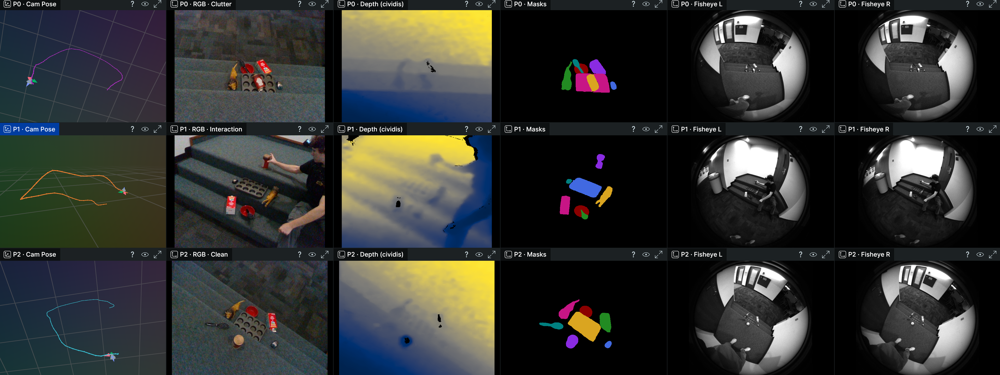

# RPX Benchmark Toolkit

**Benchmark your robot-perception model on real-world RGB-D data.**

`rpx-benchmark` is the reference toolkit for [RPX — Robot Perception
X](https://github.com/IRVLUTD/RPX). We ship **datasets, task-specific
dataloaders, metric calculators, and hardware-agnostic profiling**.
You ship the model.

There is no model registry, no CLI, no shipped model code.

---

## Quickstart

```bash
pip install 'rpx-benchmark[hub]'
```

```python
import numpy as np
import rpx_benchmark as rpx


def my_depth(rgb: np.ndarray) -> np.ndarray:
    """rgb: H x W x 3 uint8  ->  H x W float32 (metres)."""
    ...


model = rpx.make_numpy_depth_model(my_depth, name="my_depth")
cfg = rpx.MonocularDepthRunConfig(model=model, split="hard", device="cpu")
result, report, paths = rpx.run_monocular_depth(cfg)

print(result.aggregated)              # absrel, rmse, delta1..3
print(report.weighted_phase_score)    # ESD-weighted phase score
print(paths["json"])                  # result.json
```

Same shape for every task: `make_numpy_<task>_model(fn)` →
`<TaskName>RunConfig(model=...)` → `run_<task>(cfg)`.

## Bring Your Own Model — three paths

1. **Plain numpy callable.** Ten factories, one per task. Shown above.
2. **Custom `InputAdapter` / `OutputAdapter`.** When you need full
   control over preprocessing, batching, or post-processing.
3. **API / cloud model.** Wrap a remote inference service as an
   adapter and mark it `EfficiencyMetadata(model_type="api")`.

See [`docs/getting-started/bring-your-own-model.md`](docs/getting-started/bring-your-own-model.md)
for complete templates of all three.

## What the toolkit ships

| Area | Module | What's in it |
|---|---|---|
| Data contracts | `rpx_benchmark.api` | `TaskType`, `Sample`, 10 × GroundTruth, 10 × Prediction, `BenchmarkModel` ABC |
| Dataset | `rpx_benchmark.loader`, `rpx_benchmark.hub`, `rpx_benchmark.data` | `RPXDataset`, modality-aware snapshot downloads, `load_hf()` one-liner |
| Manifest validation | `rpx_benchmark.schemas` | Pydantic v2 schemas + JSON Schema export (opt-in extra) |
| Adapter framework | `rpx_benchmark.adapters` | `InputAdapter` / `OutputAdapter` protocols, `BenchmarkableModel`, 9 numpy fast-path factories |
| Metrics | `rpx_benchmark.metrics.*` | Per-task `MetricCalculator` registry |
| Tasks | `rpx_benchmark.tasks.*` | One module per task, each ~30 lines; self-register `TaskSpec` |
| Runner | `rpx_benchmark.runner` | Orchestrates dataset → model → metrics → report |
| Profiler | `rpx_benchmark.profiler` | Params, FLOPs, latency p50/p95/p99, CPU/CUDA/MPS peak memory |
| Deployment readiness | `rpx_benchmark.deployment` | ESD-weighted Phase Score, STR, Temporal Stability, SGC |
| Determinism | `rpx_benchmark.determinism` | `seed_all()`, `deterministic()` context manager |
| Reports | `rpx_benchmark.reports` | JSON + Markdown writers |

## Tasks (all 10 runnable)

| Task | Primary metric | Numpy factory |
|---|---|---|
| Monocular depth | AbsRel ↓ | `make_numpy_depth_model` |
| Object segmentation | mIoU ↑ | `make_numpy_mask_model` |
| Object detection | mAP ↑ | `make_numpy_detection_model` |
| Open-vocab detection | mAP ↑ | `make_numpy_detection_model` |
| Object tracking | MOTA ↑ | `make_numpy_tracking_model` |
| Visual grounding | grounding_acc ↑ | `make_numpy_grounding_model` |
| Relative camera pose | rotation_error_deg ↓ | `make_numpy_pose_model` |
| Sparse depth | RMSE ↓ | `make_numpy_sparse_depth_model` |
| Novel view synthesis | PSNR ↑ | `make_numpy_nvs_model` |
| Keypoint matching | keypoint_acc ↑ | `make_numpy_keypoint_model` |

## Dataset access

Two paths — pick the one that fits:

```python
# 1. HuggingFace `datasets` (streaming, one-liner)
from rpx_benchmark.data import load_hf
ds = load_hf("monocular_depth", split="hard")

# 2. Modality-aware snapshot (offline-friendly bulk)
from rpx_benchmark.hub import load
ds = load("monocular_depth", "hard")
```

Both yield `list[Sample]` batches the runner consumes interchangeably.

## Visualize a scene

One command opens an interactive [Rerun](https://rerun.io/) viewer with all six modalities (RGB, depth, fisheye stereo, instance masks, and the T265 6-DoF camera trajectory) on a shared timeline.



```bash
pip install -e '.[hub,viz]'

make visualize            # stream into viewer; no disk artifact (HF cache only)
make visualize-phases     # all 3 phases (clutter / interaction / clean) side-by-side
make visualize-save       # also write a portable .rrd to benchmark/site/
make visualize-lite       # constrained devices (Pi 4 / Jetson Nano): stride=3, smaller
make visualize-headless   # build .rrd only, no viewer (CI / SSH)
```

### Single-phase layout

```
┌──────────────┬──────────────┬──────────────┐
│   Cam Pose   │  Fisheye L   │  Fisheye R   │
├──────────────┼──────────────┼──────────────┤
│     RGB      │ Depth (mm)   │    Masks     │
└──────────────┴──────────────┴──────────────┘
```

### All-phases layout (`--all-phases`, screenshot above)

Each row is a phase, six panels per row sharing one timeline. Scrub forward and the same physical frame index advances in all 18 panels at once, so you can directly compare what the perception model sees in clutter vs. interaction vs. clean.

```
Row 0 · Clutter:     [Cam Pose] [RGB] [Depth (cividis)] [Masks] [Fisheye L] [Fisheye R]
Row 1 · Interaction: [Cam Pose] [RGB] [Depth (cividis)] [Masks] [Fisheye L] [Fisheye R]
Row 2 · Clean:       [Cam Pose] [RGB] [Depth (cividis)] [Masks] [Fisheye L] [Fisheye R]
```

### Visual conventions

- **Depth**: cividis colormap, **per-frame histogram-equalized** so subtle structure remains visible even when a frame's depth band is narrow. Invalid (`raw == 0`) pixels render black.
- **Masks**: hand-curated **royal jewel-tone palette** (sapphire, emerald, ruby, amethyst, gold, …) with deterministic `id → palette[id mod 16]` mapping. Background (id=0) is black. The same instance ID always produces the same color across frames *and* phases — useful for verifying SAM-2 tracking consistency.
- **Camera pose**: per-phase trajectory rendered as a colored polyline (magenta = clutter, orange = interaction, cyan = clean) with a Pinhole frustum that sweeps along the path as you scrub.
- **Fisheye stereo**: T265 monochrome, percentile-stretched per frame (T265 raw uint8 occupies a narrow band that displays as dark without contrast normalisation).

### Disk footprint

By default the data **streams straight from the HuggingFace cache** (`~/.cache/huggingface/hub/`) into the viewer's memory — no intermediate `.rrd` is written, so the only on-disk cost is the dataset cache itself. Pass `--save` (or use `make visualize-save`) when you want a portable `.rrd` to share or re-open later:

```bash
rerun --memory-limit 2GB site/rpx_*.rrd
```

### Keyboard shortcuts

| Key | Action |
|---|---|
| `Space` | play / pause |
| `,` / `.` | step backward / forward by one frame |
| `Home` / `End` | jump to first / last frame |

Arrow keys are reserved by Rerun for 3D camera navigation when a `Spatial3DView` has focus, so use `,` / `.` (which work regardless of focus) for frame stepping.

See `python scripts/visualize_rerun.py --help` for the full flag set (specific scene/phase, JPEG quality, frame stride, lossless mode, etc.).

## Install extras

| Extra | Pulls | Use when |
|---|---|---|
| *(core)* | `numpy`, `Pillow` | Always |
| `hub` | `huggingface_hub[hf_xet]` | Downloading from HF |
| `hf-datasets` | `datasets>=2.18` | `load_hf(...)` one-liner |
| `schemas` | `pydantic>=2.5` | Strict manifest validation |
| `viz` | `rerun-sdk`, `matplotlib`, `Pillow`, `tqdm` | `make visualize` (interactive Rerun) |
| `dev` | `pytest`, `pytest-cov`, `ruff`, `black`, `mypy`, `pre-commit` | Contributing |
| `docs` | `mkdocs`, `mkdocs-material`, `mkdocstrings[python]` | Building docs locally |

## Docs

Full site: <https://irvlutd.github.io/RPX/>

- [Quickstart](docs/getting-started/quickstart.md)
- [Load the Dataset](docs/getting-started/load-the-dataset.md)
- [Bring Your Own Model](docs/getting-started/bring-your-own-model.md)
- [Architecture Overview](docs/architecture/overview.md)
- [Adding a Task](docs/guides/adding-a-task.md)
- [Adding a Metric](docs/guides/adding-a-metric.md)
- [Contributing](docs/guides/contributing.md)

## License

MIT — see [LICENSE](LICENSE).
