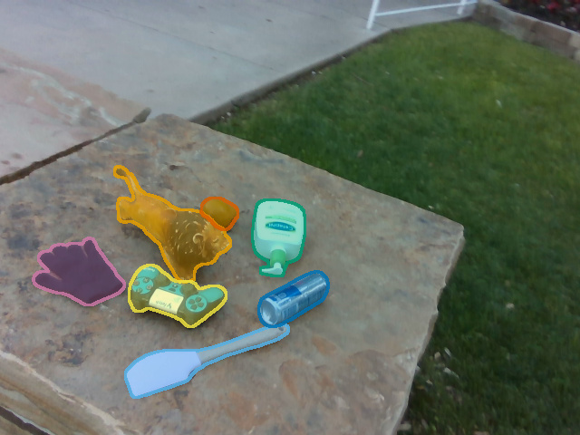
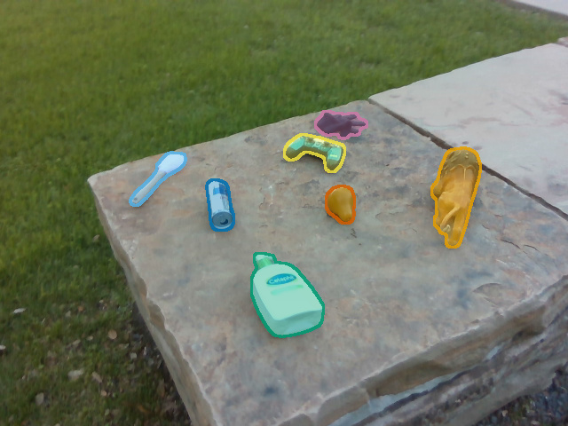
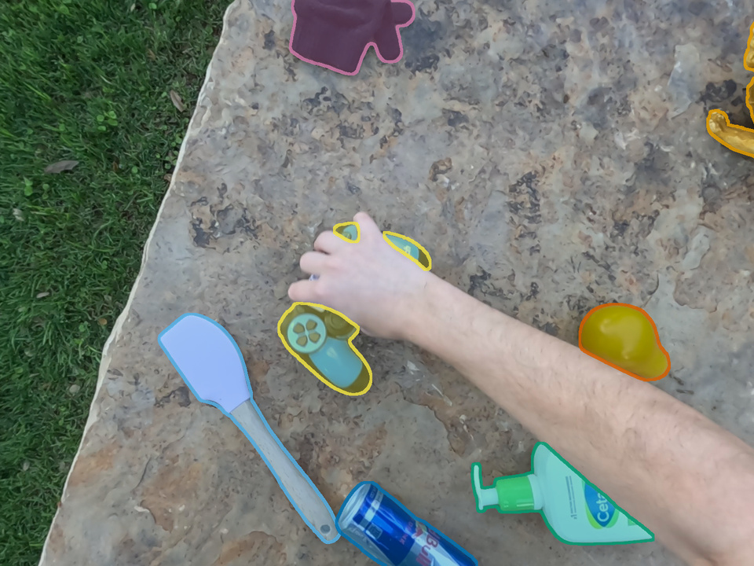

---
hide:
  - toc
---

RPX / ROBOT PERCEPTION TOOLKIT

# Perception, under interaction.

The same objects. A changing scene. Understand how your model holds up.

Evaluate pretrained models on real RGB-D captures before, during, and after manipulation. Bring your own model, extend the metrics, and keep every comparison grounded in the same data.

<a class="rpx-primary" href="getting-started/">Start benchmarking ↗</a><a class="rpx-secondary" href="api/">Explore the API →</a>

<figure class="rpx-hero-figure"><figcaption>SCENE 012 / INTERACTIONReleased instance-mask overlay</figcaption></figure>

<strong>100</strong>multi-object scenes

<strong>3</strong>capture phases

<strong>6</strong>paper tasks

<strong>70</strong>single-object captures

01 / THE DATA

## One scene. A changing world.

Clutter captures the scene before manipulation; Interaction introduces hands, occlusion, and motion; Clean records the scene afterwards. Egocentric Interaction provides another viewpoint on an independent clock. Object identities connect the views and phases.

<figure><figcaption>01 / CLUTTERBefore manipulation</figcaption></figure>
<figure><figcaption>02 / INTERACTIONHands, motion, occlusion</figcaption></figure>
<figure><figcaption>03 / CLEANAfter manipulation</figcaption></figure>
<figure><figcaption>+ / EGOCENTRICA separate viewpoint</figcaption></figure>

Representative frames from outdoor scene 091, shown with released mask overlays. The four views are not frame-synchronized.

02 / THE TOOLKIT

## From predictions to evidence.

A versioned manifest selects the samples. The loader resolves inputs and ground truth, an adapter connects your model, and task-specific metrics produce per-sample records and aggregate reports. Model weights remain separate from the toolkit.

<b>01</b> Manifest<i aria-hidden="true">→</i><b>02</b> Loader<i aria-hidden="true">→</i><b>03</b> Your model<i aria-hidden="true">→</i><b>04</b> Metrics<i aria-hidden="true">→</i><b>05</b> Reports

<a href="getting-started/">01<strong>Run a benchmark</strong><small>Install, load your manifest, and inspect results.</small>↗</a>
<a href="models/">02<strong>Bring your own model</strong><small>Connect a local callable or an API-backed model.</small>↗</a>
<a href="metrics/">03<strong>Add a metric</strong><small>Register a calculator with a tested scoring contract.</small>↗</a>
<a href="tasks/">04<strong>Extend the tasks</strong><small>Define inputs, ground truth, adapters, and evaluation.</small>↗</a>

## Six tasks. Shared scenes.

| Task | Input | Evaluation |
| --- | --- | --- |
| T1 · Image depth | RGB image | Metric-depth accuracy |
| T2 · Video depth | RGB sequence | Depth accuracy and temporal consistency |
| T3 · Object tracking | Video and initialization | Multi-object tracking and identity consistency |
| T4 · Relative camera pose | Image pairs | Relative-pose errors and threshold AUC |
| T5 · Visual grounding | Image and text question | Localization accuracy |
| T6 · In-context grounding | Image, question, and reference image | Reference-conditioned localization |

T5 and T6 use visual-grounding tooling with distinct protocols. The toolkit also exposes detection, segmentation, sparse depth, and keypoint matching; `available_tasks()` lists the registered runners.

03 / THE MODALITIES

## More than an RGB frame.

Exocentric captures combine RGB, metric depth, instance masks, calibrated fisheye stereo, and camera pose. Each modality plays a different role in loading, evaluation, and checking predictions.

<figure><figcaption>RGBAppearance and model input</figcaption></figure>
<figure><figcaption>METRIC DEPTHGeometry and depth ground truth</figcaption></figure>
<figure><figcaption>FISHEYE / LEFTCalibrated stereo input</figcaption></figure>
<figure><figcaption>FISHEYE / RIGHTPaired viewpoint</figcaption></figure>

RGB, colorized depth, and stereo examples from the same SOS capture. The depth visualization is illustrative; scoring uses the released metric values, not image colors. See the <a href="data/">data guide</a> for annotation and modality details.

## Concepts and acronyms

- **MOS / SOS:** multi-object scenes / single-object captures.
- **Phase:** Clutter, Interaction, or Clean. Egocentric Interaction is a separate view.
- **ESD:** empirical scene difficulty, used to group scenes by difficulty.
- **J / Jmin:** normalized desirability and worst-phase quality.
- **Φ:** phase robustness from the paper analysis tools; it is not the mean of raw metric values.
- **GT:** ground truth. Keep units, coordinates, and object identities consistent across predictions and GT.

## Build on the benchmark.

Start with a small integration run. Scale to the full protocol once shapes, units, IDs, and sample coverage agree.

[Get started →](getting-started/README.md) · [API reference](api/README.md) · [GitHub](https://github.com/IRVLUTD/RPX) · [PyPI](https://pypi.org/project/rpx-benchmark/)

The toolkit is released under the MIT license. Check dataset and pretrained-model licenses separately.

