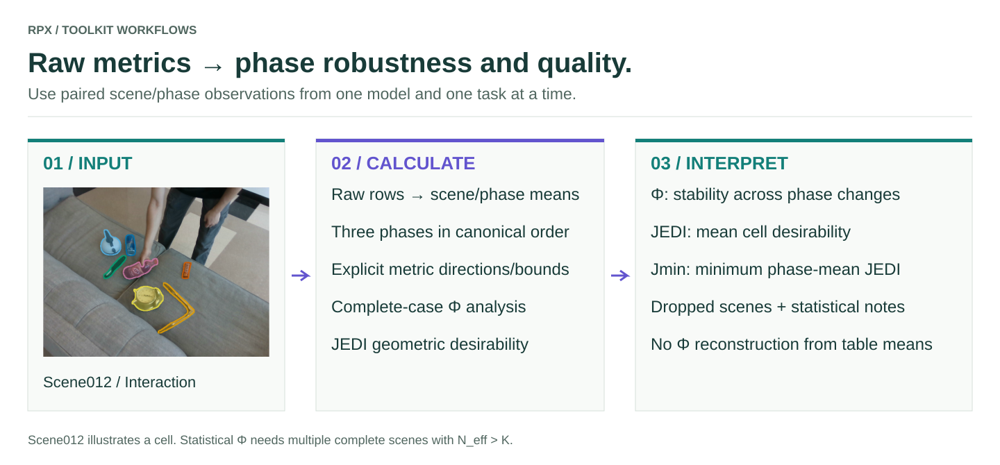

# Φ and JEDI from raw metrics

Separate **robustness to phase changes** from **prediction quality**. Φ summarizes phase robustness using repeated-measures analysis; JEDI combines direction-aware metric desirabilities; `Jmin` is the lowest phase-mean JEDI quality.

<figure class="rpx-workflow-figure"><a href="../assets/phi-jedi.svg"></a><figcaption>Scene012 illustrates the data join; statistical analysis needs multiple complete scenes. Open the vector figure to zoom or reuse it.</figcaption></figure>

## What the scores mean

| Score | Computation | Interpretation |
| --- | --- | --- |
| **Φ** | `1 − effect size` from repeated-measures MANOVA; conservative minimum of Wilks/Pillai estimates | Higher means less phase-associated variation; it does not guarantee accurate predictions |
| **JEDI / J** | Geometric mean of metric desirabilities per cell, then mean over retained scene/phase cells | Higher means better joint quality under the declared normalization windows |
| **Jmin** | Minimum of the three phase-mean JEDI scores | Quality in the weakest phase; distinct from overall JEDI |

For a raw metric `x`, individual desirability is `clip((x − worst)/(best − worst), 0, 1)`. Bounds encode direction: lower-is-better metrics have `best < worst`. Strict JEDI uses no positive floor, so one zero desirability makes that cell's composite zero. Empirical bounds are part of the evaluation protocol; use the same frozen bounds for comparisons.

## Prepare raw records

Use CSV, JSONL, a JSON list, or runner JSON containing `per_sample`. Each row must include `scene` (or `scene_id`), `phase`, and the selected numeric metric columns. Optional `model` and `task` columns prevent independent runs from being combined. Use `clutter`, `interaction`, `clean` or `0`, `1`, `2` for phases. Values must be finite and in each metric's documented units; directions/bounds come from registered `MetricSpec` objects.

```json
{"model":"my-depth-model","task":"T1","scene":"scene012","phase":"interaction","absrel":0.12,"rmse":0.36,"delta1":0.84}
```

That is a **schema illustration**, not a reported model result. A single scene cannot support Φ. Multiple observations in one scene/phase are averaged into a cell; scenes missing any required phase are dropped and counted. Each run must contain all three phases overall. Keep the same sample policy and eligible scene set across models, and inspect dropped scenes before comparing scores.

## Run the packaged calculator

```bash
python -m rpx_benchmark.examples.summarize_metrics \
  --input raw_metrics.jsonl --metrics absrel rmse delta1 \
  --output results/phi-jedi.json
```

The output records the source SHA256, chosen metric specs, canonical phase order, independent model/task summaries, `n_eff`, `n_dropped`, per-phase means, transition tests, statistical notes and `j_min`. Insufficient or singular data can leave Φ unavailable while JEDI remains reported; do not interpret unavailable Φ as zero robustness. Φ needs more complete scenes than metric columns (`N_eff > K`) and adequate within-phase variation.

The three-metric command is an **integration example**. Reproduce the paper using its task-specific frozen metric vector and bounds: image depth uses `(absrel, rmse, delta1, silog, fscore_5cm)` and video depth uses `(absrel, rmse, delta1, silog, tgm, tgse)`. Other task protocols require their corresponding metric vectors. A printed aggregate table cannot recover the paired raw observations needed for Φ.

## A complete synthetic check

This fixture exercises the calculator; it is not empirical RPX performance.

```python
import json
import numpy as np
from rpx_benchmark.examples.summarize_metrics import calculate

rng = np.random.default_rng(7)
rows = [
    {'model': 'synthetic', 'task': 'demo', 'scene': f'scene{s:03d}',
     'phase': phase, 'absrel': float(rng.uniform(0.04, 0.18)),
     'rmse': float(rng.uniform(0.12, 0.5)), 'delta1': float(rng.uniform(0.7, 0.98))}
    for s in range(20) for phase in ('clutter', 'interaction', 'clean')
]
summary = calculate(rows, ['absrel', 'rmse', 'delta1'])
assert summary['results'][0]['n_eff'] == 20
assert summary['results'][0]['phi'] is not None
print(json.dumps(summary, indent=2, allow_nan=False))
```

## Extend the analysis

Adding a metric calculator does not automatically include it in Φ/JEDI. Register a `MetricSpec` with its unique name, direction, best/worst bounds and bound provenance, then explicitly select it. Do not tune bounds on each model's own results. A new vector is a new protocol and must be identified in reported comparisons.

[`summarize_phi_jedi` API](https://irvlutd.github.io/RPX/toolkit-docs/rpx_benchmark/phi_jedi_summary.html#summarize_phi_jedi) · [Φ API](https://irvlutd.github.io/RPX/toolkit-docs/rpx_benchmark/phi.html) · [JEDI API](https://irvlutd.github.io/RPX/toolkit-docs/rpx_benchmark/jedi.html) · [Metric specs](https://irvlutd.github.io/RPX/toolkit-docs/rpx_benchmark/metrics/specs.html) · [Add metrics](../metrics/README.md)
