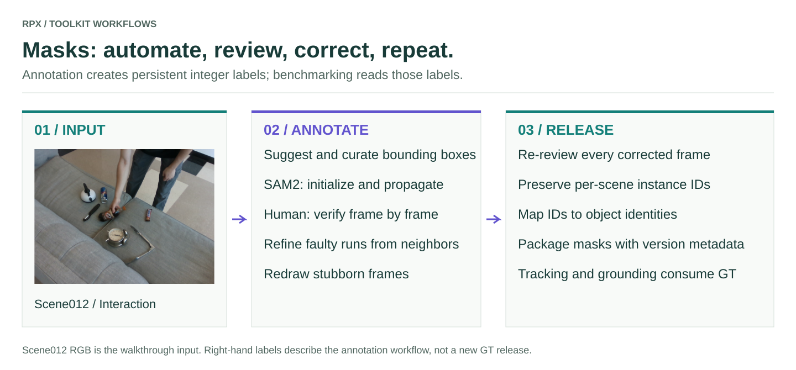

# Mask annotation pipeline

Build ground-truth instance masks for new captures, then review and refine them. Released RPX masks can be used directly for benchmarking; annotation is a separate source-checkout workflow.

<figure class="rpx-workflow-figure"><a href="../assets/mask-pipeline.svg"></a><figcaption>Scene012 is the common walkthrough scene. This diagram explains the process; it does not claim that a new annotation release has been generated. Open the vector figure to zoom or reuse it.</figcaption></figure>

## What the pipeline does

| Stage | Tool | Output |
| --- | --- | --- |
| Suggest and curate | `maskgen_pipeline.interactive_gsam2` | Human-approved GroundingDINO boxes and SAM2 initialization |
| Propagate | SAM2 inside the interactive pipeline | Per-frame integer instance masks |
| Verify | `maskgen_pipeline.review_faulty_masks` | A saved verified-frame list |
| Identify gaps | `maskgen_pipeline.gen_faulty_from_verified` | Faulty frames = all frames minus verified frames |
| Refine | `maskgen_pipeline.refine_masks_flow` | SAM2 propagated from verified neighbors |
| Correct stubborn frames | `maskgen_pipeline.manual_label_faulty` | Manual correction with persistent instance IDs |
| Attach identity | `visual_grounding_gt.mask_to_object` | Mask-ID to object-name mapping |

## Set up the annotation environment

These tools live in [`data/mask_annotation/`](https://github.com/IRVLUTD/RPX/tree/main/data/mask_annotation), **outside the PyPI wheel**. Use a separate CUDA environment with compatible SAM2, GroundingDINO, [RoboKit](https://github.com/IRVLUTD/robokit), and a graphical display for human review. The annotation requirements and upstream model weights are separate from the lightweight benchmark install. Follow the [source setup guide](https://github.com/IRVLUTD/RPX/blob/main/data/mask_annotation/README.md#-quick-start).

```bash
git clone https://github.com/IRVLUTD/RPX.git
cd RPX/data/mask_annotation
python -m pip install -r requirements.txt
# Install compatible PyTorch/CUDA, RoboKit, SAM2 and GroundingDINO
# in this annotation environment before invoking the interactive tools.
```

## Annotate one phase

Use an unpacked capture tree with `rgb/` under each phase. Numeric directories `0`, `1`, `2` mean Clutter, Interaction, Clean. Work on a **copy** of a capture: the reverse-propagation tool reverses modality filenames and refinement updates masks in place.

```bash
# Run from RPX/data/mask_annotation, in the prepared annotation environment.
export RPX_SCENE=/path/to/working-copy/scene012
python -m maskgen_pipeline.interactive_gsam2 --scene_dir "$RPX_SCENE/1"
python -m maskgen_pipeline.review_faulty_masks --base_dir "$RPX_SCENE/1"
python -m maskgen_pipeline.gen_faulty_from_verified --scene_dir "$RPX_SCENE/1" --iter 1
# Skip refinement if the faulty list is empty.
python -m maskgen_pipeline.refine_masks_flow --scene_dir "$RPX_SCENE/1" --iter 1
python -m maskgen_pipeline.review_faulty_masks --base_dir "$RPX_SCENE/1" --no_verified
# Use this fallback only for frames still needing correction.
python -m maskgen_pipeline.manual_label_faulty --scene_dir "$RPX_SCENE/1" --iter 1
```

Repeat for other phases as needed. A phase produces `sam2/masks/<frame>.png` with background `0` and nonzero instance IDs. An overlay image is only a visualization; the integer map is the annotation used for scoring.

## Verification and identity

In the reviewer, **S** marks a frame verified; **X** removes verification; arrows navigate; **T** toggles contours; **Q** saves and exits. Refinement must be followed by another review. Check small, occluded, and newly visible objects as well as large foreground objects.

Keep mask IDs stable across phases and join them through the released object mapping when assigning global IDs. Never renumber objects separately in each frame. Distinguish an object outside the field of view from a visible object missing a mask. The availability of an overlay alone does not establish annotation completeness.

Before packaging, verify frame coverage, integer labels, object mappings, and alignment of RGB/depth/mask filenames. Preserve capture order, calibration, mapping metadata, and version the corrected labels. Benchmark predictions must never replace GT.

## Related tools

The repository also contains bounding-box review, verified-box SAM2 runs, egocentric extraction/annotation, mask visualization, spatial question generation, and VQA GT construction. Browse the [annotation source directory](https://github.com/IRVLUTD/RPX/tree/main/data/mask_annotation/maskgen_pipeline) and [VQA GT tooling](https://github.com/IRVLUTD/RPX/tree/main/data/mask_annotation/visual_grounding_gt/vqa_gt).

[Data contracts](../data/README.md) · [T3 tracking](../benchmarks/t3/README.md) · [T5 grounding](../benchmarks/t5/README.md) · [Citation](../citation/README.md)
