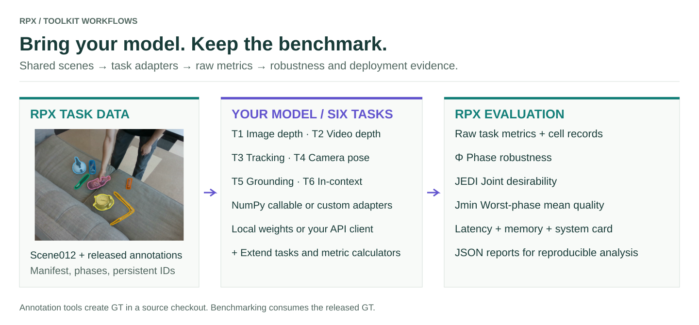

# Benchmark all six tasks

Use one shared dataset and task-specific protocols. The figures use **scene012** throughout, so you can follow the same scene from image depth to grounding. The command examples accept real task manifests and your model callables; the packaged smoke mode verifies integration without downloading models or data.

<figure class="rpx-workflow-figure"><a href="../assets/toolkit-overview.svg"></a><figcaption>T6 additionally uses a matched SOS reference crop. Ground truth remains inside the evaluator. Open the vector figure to zoom or reuse it.</figcaption></figure>

## Choose a task

| Task | Model input → prediction | Example |
| --- | --- | --- |
| T1 Image depth | RGB → metric depth map | [Run T1](t1/README.md) |
| T2 Video depth | RGB clip → depth sequence | [Run T2](t2/README.md) |
| T3 Tracking | Frames and initialization → persistent tracks | [Run T3](t3/README.md) |
| T4 Relative camera pose | RGB pair → relative rotation/translation | [Run T4](t4/README.md) |
| T5 Visual grounding | Target RGB + question → target box | [Run T5](t5/README.md) |
| T6 In-context grounding | SOS reference crop + target RGB + question → target box | [Run T6](t6/README.md) |

## Six offline integration runs

```bash
python -m pip install 'rpx-benchmark[hub,schemas]'
python -m rpx_benchmark.examples.benchmark_tasks \
  --task all --smoke --output results/six-task-smoke
```

Use a fresh output directory. This creates tiny **synthetic** RGB/depth/mask/pose/question fixtures and runs the installed public pipelines. The toy callables do not load pretrained models or establish full paper-protocol accuracy. Each task writes reports under its own directory. T5/T6 use the canonical VQA parser and evaluator; T6 checks the ordered two-image interface.

## Move to real data

For T1–T4, provide a task-specific JSON manifest with its `root`, `task`, and `samples`. Modality paths are resolved against `root`. The [Hub downloader](https://irvlutd.github.io/RPX/toolkit-docs/rpx_benchmark/hub.html#download_split) returns a resolved local manifest when downloading a supported task/split. For locally staged captures, the repository's [manifest tools](https://github.com/IRVLUTD/RPX/blob/main/benchmark/scripts/local_manifest.py) generate the appropriate records; pair tasks require their pairing protocol as well.

### Download a small image-depth task manifest

```python
from rpx_benchmark.hub import download_split
manifest_path = download_split('monocular_depth', 'easy', max_samples=10)
print(manifest_path)
```

The same API accepts `video_depth`, `object_tracking`, and `relative_camera_pose` where the selected release contains the corresponding task manifest. For video, the limit counts clips. A small manifest can still require a large modality shard; downloading ten entries does not imply ten independent tiny files. Pass a pinned `revision` when reproducing a specific release.

### Prepare canonical VQA samples

For T5/T6, use canonical VQA JSONL generated from the released question Parquets. Ground truth, locators, question types, immutable reference revisions and crop hashes must survive conversion. An RGB path list or an ordinary `visual_grounding` task manifest is not a replacement for this contract. See the [VQA contract API](https://irvlutd.github.io/RPX/toolkit-docs/rpx_benchmark/vqa/contract.html).

From a repository checkout, the supplied acceptance tools build a deterministic subset spanning one- and two-image bbox questions:

```bash
python benchmark/scripts/fetch_vqa_smoke_parquets.py --out data/vqa-parquets
python benchmark/scripts/build_vqa_acceptance_sample.py \
  --parquet-dir data/vqa-parquets --out manifests/vqa-acceptance.jsonl
python - <<'PYVQA'
from rpx_benchmark.vqa.contract import load_manifest, write_manifest
samples = load_manifest('manifests/vqa-acceptance.jsonl')
write_manifest([s for s in samples if not s.is_in_context], 'manifests/T5/acceptance.jsonl')
write_manifest([s for s in samples if s.is_in_context], 'manifests/T6/acceptance.jsonl')
PYVQA
```

Use those two paths in the T5/T6 callable commands. This is an acceptance subset, not the complete paper evaluation split. The fetcher pins its source revision and `write_manifest` preserves canonical crop/locator metadata. See the [source tool](https://github.com/IRVLUTD/RPX/blob/main/benchmark/scripts/build_vqa_acceptance_sample.py) for its selection protocol.

Keep train/test separation, dataset revisions, preprocessing, phase coverage, and metric settings identical across model comparisons. For a paper reproduction, use the task's reference scripts and model container dependencies; generic callable smoke results alone do not reproduce sequence-level tracking or the full pose-pair protocol.

## Reference models and outputs

The repository provides pretrained model runners and container recipes separately from the PyPI package. Start with the [reference model guide](https://github.com/IRVLUTD/RPX/blob/main/benchmark/README.md#reference-models) and [container guide](https://github.com/IRVLUTD/RPX/tree/main/docker). Model weights and licenses are managed by the upstream projects.

Frame/clip runners return `(result, deployment_report, paths)` and write JSON, summaries and cell logs. VQA writes `run_config.json`, `predictions.jsonl`, and `result.json`; parsing/inference failures remain in the denominator. Check the number of requested and scored samples before aggregating.

[Hardware measurements](../profiling/README.md) · [Φ/JEDI calculation](../analysis/README.md) · [Bring your own model](../models/README.md)
