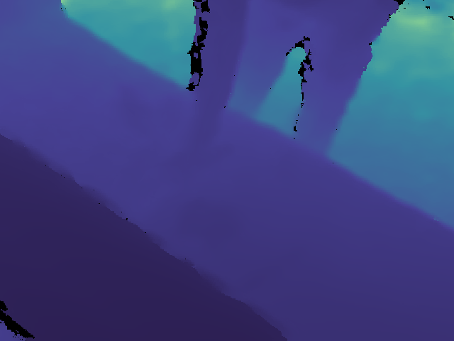
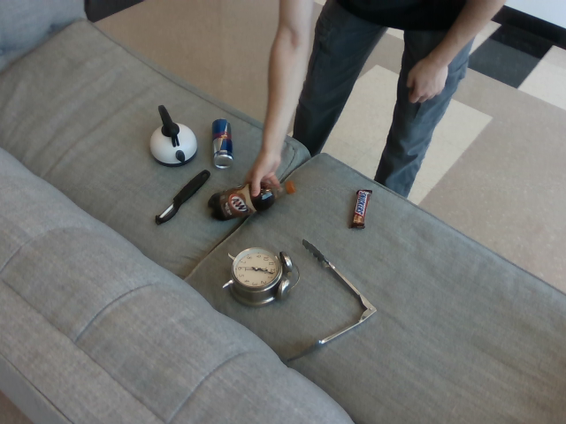
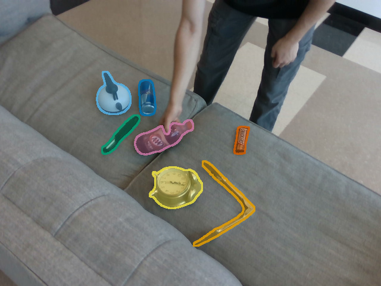
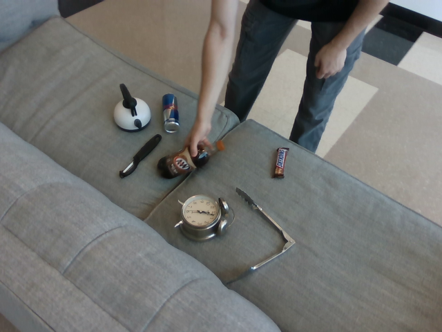

<div class="rpx-benchmark-page" markdown="1">

<p class="rpx-task-kicker">RPX / BENCHMARK EXAMPLES</p>

# One scene. Six ways to benchmark.

<div class="rpx-task-lead" markdown="1">
Follow **scene012** from depth estimation to in-context grounding. Each walkthrough shows the inputs, adapter, runnable command and scoring protocol for one task.
</div>

<div class="rpx-benchmark-gallery">
<a class="rpx-task-preview" href="t1/">

<div><span class="rpx-task-id">T1 / WALKTHROUGH</span><strong>Image depth</strong><span class="rpx-task-description">One RGB image → Depth map in metres</span><span class="rpx-task-open">Open example <span aria-hidden="true">↗</span></span></div>
</a>
<a class="rpx-task-preview" href="t2/">

<div><span class="rpx-task-id">T2 / WALKTHROUGH</span><strong>Video depth</strong><span class="rpx-task-description">Ordered RGB clip → Depth sequence</span><span class="rpx-task-open">Open example <span aria-hidden="true">↗</span></span></div>
</a>
<a class="rpx-task-preview" href="t3/">

<div><span class="rpx-task-id">T3 / WALKTHROUGH</span><strong>Object tracking</strong><span class="rpx-task-description">Frames + initialization → Boxes + persistent IDs</span><span class="rpx-task-open">Open example <span aria-hidden="true">↗</span></span></div>
</a>
<a class="rpx-task-preview" href="t4/">

<div><span class="rpx-task-id">T4 / WALKTHROUGH</span><strong>Camera pose</strong><span class="rpx-task-description">Two RGB frames → Relative rotation + translation</span><span class="rpx-task-open">Open example <span aria-hidden="true">↗</span></span></div>
</a>
<a class="rpx-task-preview" href="t5/">

<div><span class="rpx-task-id">T5 / WALKTHROUGH</span><strong>Visual grounding</strong><span class="rpx-task-description">Target image + question → Target box or binary answer</span><span class="rpx-task-open">Open example <span aria-hidden="true">↗</span></span></div>
</a>
<a class="rpx-task-preview" href="t6/">

<div><span class="rpx-task-id">T6 / WALKTHROUGH</span><strong>In-context grounding</strong><span class="rpx-task-description">SOS reference + target + question → Target box or binary answer</span><span class="rpx-task-open">Open example <span aria-hidden="true">↗</span></span></div>
</a>
</div>

<p class="rpx-image-note">Real RPX imagery and released annotations. Thumbnails show inputs or ground truth, not model predictions. T6 adds a matched SOS reference to the same scene012 target.</p>

## Start with an offline check

```bash title="Terminal · six-task integration check"
python -m pip install 'rpx-benchmark[hub,schemas]'
python -m rpx_benchmark.examples.benchmark_tasks \
  --task all --smoke --output results/six-task-smoke
```

The installed toolkit creates tiny **synthetic** fixtures and runs all six public pipelines. Each task writes reports into its own directory. Use a fresh output directory.

<div class="rpx-task-note" markdown="1">
**What this checks:** adapter interfaces, scoring and report generation. Toy callables do not load pretrained models or establish paper accuracy. T5/T6 exercise the canonical VQA parser; T6 checks the ordered two-image interface.
</div>

## Move to real data

For T1–T4, provide a task-specific JSON manifest with its `root`, `task`, and `samples`. Modality paths are resolved against `root`. The [Hub downloader](https://irvlutd.github.io/RPX/toolkit-docs/rpx_benchmark/hub.html#download_split) returns a resolved local manifest when downloading a supported task/split. For locally staged captures, the repository's [manifest tools](https://github.com/IRVLUTD/RPX/blob/main/benchmark/scripts/local_manifest.py) generate the appropriate records; pair tasks require their pairing protocol as well.

### Download a small image-depth task manifest

```python
from rpx_benchmark.hub import download_split
manifest_path = download_split('monocular_depth', 'easy', max_samples=10)
print(manifest_path)
```

The same API accepts `video_depth`, `object_tracking`, and `relative_camera_pose` where the selected release contains the corresponding task manifest. For video, the limit counts clips. A small manifest can still require a large modality shard; downloading ten entries does not imply ten independent tiny files. Pass a pinned `revision` when reproducing a specific release.

### Prepare canonical VQA samples

For T5/T6, use canonical VQA JSONL generated from the released question Parquets. Ground truth, locators, question types, immutable reference revisions and crop hashes must survive conversion. An RGB path list or an ordinary `visual_grounding` task manifest is not a replacement for this contract. See the [VQA contract API](https://irvlutd.github.io/RPX/toolkit-docs/rpx_benchmark/vqa/contract.html).

From a repository checkout, the supplied acceptance tools build a deterministic subset spanning one- and two-image bbox questions:

```bash
python benchmark/scripts/fetch_vqa_smoke_parquets.py --out data/vqa-parquets
python benchmark/scripts/build_vqa_acceptance_sample.py \
  --parquet-dir data/vqa-parquets --out manifests/vqa-acceptance.jsonl
python - <<'PYVQA'
from rpx_benchmark.vqa.contract import load_manifest, write_manifest
samples = load_manifest('manifests/vqa-acceptance.jsonl')
write_manifest([s for s in samples if not s.is_in_context], 'manifests/T5/acceptance.jsonl')
write_manifest([s for s in samples if s.is_in_context], 'manifests/T6/acceptance.jsonl')
PYVQA
```

Use those two paths in the T5/T6 callable commands. This is an acceptance subset, not the complete paper evaluation split. The fetcher pins its source revision and `write_manifest` preserves canonical crop/locator metadata. See the [source tool](https://github.com/IRVLUTD/RPX/blob/main/benchmark/scripts/build_vqa_acceptance_sample.py) for its selection protocol.

Keep train/test separation, dataset revisions, preprocessing, phase coverage, and metric settings identical across model comparisons. For a paper reproduction, use the task's reference scripts and model container dependencies; generic callable smoke results alone do not reproduce sequence-level tracking or the full pose-pair protocol.

## Reference models and outputs

The repository provides pretrained model runners and container recipes separately from the PyPI package. Start with the [reference model guide](https://github.com/IRVLUTD/RPX/blob/main/benchmark/README.md#reference-models) and [container guide](https://github.com/IRVLUTD/RPX/tree/main/docker). Model weights and licenses are managed by the upstream projects.

Frame/clip runners return `(result, deployment_report, paths)` and write JSON, summaries and cell logs. VQA writes `run_config.json`, `predictions.jsonl`, and `result.json`; parsing/inference failures remain in the denominator. Check the number of requested and scored samples before aggregating.

[Hardware measurements](../profiling/README.md) · [Φ/JEDI calculation](../analysis/README.md) · [Bring your own model](../models/README.md)

</div>
