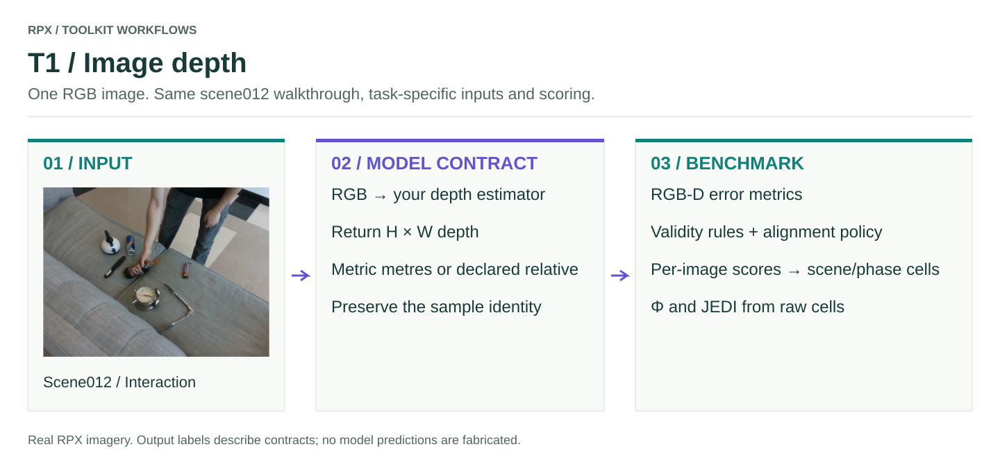

# T1 · Image depth

One `H × W × 3` RGB image → an `H × W` floating depth map in **metres**.

<figure class="rpx-workflow-figure"><a href="../../assets/benchmark-t1.svg"></a><figcaption>This figure shows the T1 interface, not a pretrained-model prediction. Open the vector figure to zoom or reuse it.</figcaption></figure>

## Run the offline smoke example

```bash
python -m rpx_benchmark.examples.benchmark_tasks \
  --task T1 --smoke --output results/t1-smoke
```

This runs a tiny synthetic fixture with a toy callable. Use a fresh output directory; no model weights or dataset downloads are required.

## Run your model on RPX

After preparing the task-specific manifest and your `my_model.py` callable:

```bash
python -m rpx_benchmark.examples.benchmark_tasks \
  --task T1 --manifest manifests/T1/hard.json \
  --model my_model:predict_depth --model-name my-model \
  --model-revision exact-checkpoint-or-api-version \
  --output results/my-model/T1 \
  --device cuda --split hard --max-samples 10
```

For an installed Hub manifest, download a supported task split with `download_split`, then pass its returned local JSON path. `max_samples=10` is an integration subset; omit it for the full protocol.

## Adapter and scoring contract

```python
import numpy as np

def predict_depth(rgb):
    # Replace with actual model inference; preserve metre units.
    depth_metres = model.predict(rgb)
    return np.asarray(depth_metres, dtype=np.float32)
```

`model` is your initialized estimator, not an RPX-provided object. If the model emits relative depth, pass `--depth-output-kind relative` and preserve the task's pooled scene/phase alignment protocol. Metric outputs should use `metric` (the default).

The public runner emits raw depth errors and cell records. GT validity is task defined; do not count invalid depth pixels as zero-depth targets. The fixed-intrinsics paper F-score needs the canonical image size and camera calibration. Small synthetic images validate plumbing rather than every geometric diagnostic.

## Check before a full benchmark

Verify units and shapes, input ordering, frame/object/sample IDs, and that every requested prediction is accounted for. Load the model once per process, pin its revision, and keep the same data split and preprocessing across comparisons. Real pretrained inference requires that model's environment and weights; the packaged smoke fixture does not replace it.

[All task samples](../README.md) · [Model integration](../../models/README.md) · [Hardware profiler](../../profiling/README.md) · [Φ/JEDI](../../analysis/README.md)
