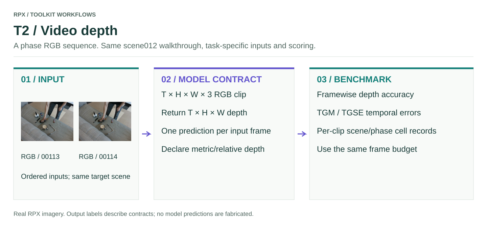

# T2 · Video depth

One `T × H × W × 3` phase RGB clip → a `T × H × W` depth sequence.

<figure class="rpx-workflow-figure"><a href="../../assets/benchmark-t2.svg"></a><figcaption>This figure shows the T2 interface, not a pretrained-model prediction. Open the vector figure to zoom or reuse it.</figcaption></figure>

## Run the offline smoke example

```bash
python -m rpx_benchmark.examples.benchmark_tasks \
  --task T2 --smoke --output results/t2-smoke
```

This runs a tiny synthetic fixture with a toy callable. Use a fresh output directory; no model weights or dataset downloads are required.

## Run your model on RPX

After preparing the task-specific manifest and your `my_model.py` callable:

```bash
python -m rpx_benchmark.examples.benchmark_tasks \
  --task T2 --manifest manifests/T2/hard.json \
  --model my_model:predict_video_depth --model-name my-model \
  --model-revision exact-checkpoint-or-api-version \
  --output results/my-model/T2 \
  --device cuda --split hard --max-samples 10
```

For an installed Hub manifest, download a supported task split with `download_split`, then pass its returned local JSON path. `max_samples=10` is an integration subset; omit it for the full protocol.

## Adapter and scoring contract

```python
import numpy as np

def predict_video_depth(rgb):
    return np.asarray(model.predict_clip(rgb), dtype=np.float32)
```

The callable must preserve input frame order and return the same `T`. Use `--depth-output-kind relative` only for relative predictions; those receive the documented per-clip scale/shift fit. Compare models with the same clip length, frame sampling and alignment protocol.

Video scoring combines framewise depth accuracy and RGB-D temporal metrics (`tgm`, `tgse`). The paper headline vector excludes pose- and flow-dependent diagnostics. In this runner, `--max-samples` limits **clips**, not individual frames. The `VideoDepthRunConfig` API exposes frame-budget and sampling controls for ablations.

## Check before a full benchmark

Verify units and shapes, input ordering, frame/object/sample IDs, and that every requested prediction is accounted for. Load the model once per process, pin its revision, and keep the same data split and preprocessing across comparisons. Real pretrained inference requires that model's environment and weights; the packaged smoke fixture does not replace it.

[All task samples](../README.md) · [Model integration](../../models/README.md) · [Hardware profiler](../../profiling/README.md) · [Φ/JEDI](../../analysis/README.md)
