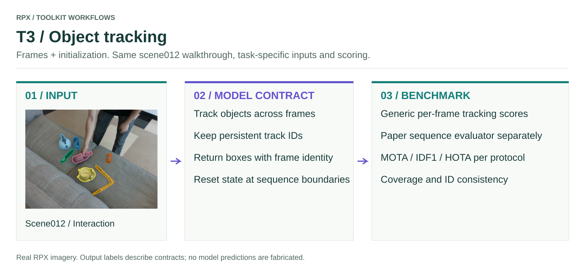

# T3 · Object tracking

RGB frames, sequence boundaries and protocol-specific initialization → boxes with persistent track IDs.

<figure class="rpx-workflow-figure"><a href="../../assets/benchmark-t3.svg"></a><figcaption>This figure shows the T3 interface, not a pretrained-model prediction. Open the vector figure to zoom or reuse it.</figcaption></figure>

## Run the offline smoke example

```bash
python -m rpx_benchmark.examples.benchmark_tasks \
  --task T3 --smoke --output results/t3-smoke
```

This runs a tiny synthetic fixture with a toy callable. Use a fresh output directory; no model weights or dataset downloads are required.

## Run your model on RPX

After preparing the task-specific manifest and your `my_model.py` callable:

```bash
python -m rpx_benchmark.examples.benchmark_tasks \
  --task T3 --manifest manifests/T3/hard.json \
  --model my_model:predict_tracks --model-name my-model \
  --model-revision exact-checkpoint-or-api-version \
  --output results/my-model/T3 \
  --device cuda --split hard --max-samples 10
```

For an installed Hub manifest, download a supported task split with `download_split`, then pass its returned local JSON path. `max_samples=10` is an integration subset; omit it for the full protocol.

## Adapter and scoring contract

```python
# Stateful object: initialize once per sequence, then update per frame.
def predict_tracks(rgb):
    return tracker.update(rgb)  # [{"track_id": "1", "boxes": boxes_xyxy}, ...]
```

The simple callable path invokes the per-frame tracking adapter and registered tracking metrics. It expects instance identities consistent with the local GT contract; it is an integration path, **not the full sequence-level paper evaluator**. Provide state/initialization in your module and reset it at sequence boundaries. Do not treat each frame as an independent detector when evaluating a tracker.

For paper-model tracking runs and sequence-level metrics, use [`run_tracking_paper.py`](https://github.com/IRVLUTD/RPX/blob/main/benchmark/scripts/run_tracking_paper.py), [`run_tracking_gate.py`](https://github.com/IRVLUTD/RPX/blob/main/benchmark/scripts/run_tracking_gate.py), and the pinned evaluator protocol. Their `--help` defines the model-specific initialization, mask outputs and sequence settings. HOTA/IDF1 values from a sequence evaluator should not be substituted with framewise smoke scores.

## Check before a full benchmark

Verify units and shapes, input ordering, frame/object/sample IDs, and that every requested prediction is accounted for. Load the model once per process, pin its revision, and keep the same data split and preprocessing across comparisons. Real pretrained inference requires that model's environment and weights; the packaged smoke fixture does not replace it.

[All task samples](../README.md) · [Model integration](../../models/README.md) · [Hardware profiler](../../profiling/README.md) · [Φ/JEDI](../../analysis/README.md)
