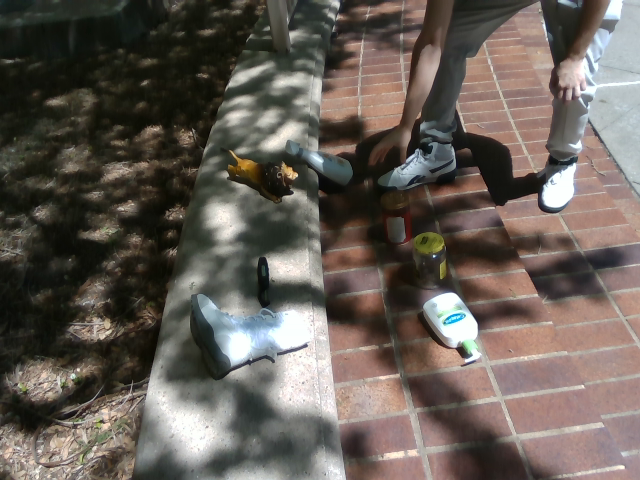

<div class="rpx-benchmark-page" markdown="1">

<div class="rpx-task-switcher" role="navigation" aria-label="Benchmark tasks">
<a href="../t1/"><span>T1</span>Image depth</a>
<a href="../t2/"><span>T2</span>Video depth</a>
<a href="../t3/" aria-current="page"><span>T3</span>Object tracking</a>
<a href="../t4/"><span>T4</span>Camera pose</a>
<a href="../t5/"><span>T5</span>VQA</a>
<a href="../t6/"><span>T6</span>In-context VQA</a>
</div>

<p class="rpx-task-kicker">T3 WALKTHROUGH</p>

# Object tracking

<div class="rpx-task-lead" markdown="1">
Takes RGB frames in order, with sequence boundaries and an initialization, and returns boxes with persistent track IDs.
</div>

<div class="rpx-task-shortcuts"><a href="#run-the-benchmark">Run it <span aria-hidden="true">↓</span></a><a href="../#move-to-real-data">Use local data <span aria-hidden="true">↗</span></a></div>

<div class="rpx-task-visual">
<figure><figcaption><span>MODEL INPUT</span>RGB · frame 00185</figcaption></figure>
<figure><figcaption><span>GROUND TRUTH</span>Released instance-mask overlay</figcaption></figure>
</div>
<p class="rpx-image-note">Scene 049, Interaction, frame 00185. The overlay shows the released ground-truth masks, whose identities persist across the sequence.</p>

<div class="rpx-task-contract">
<div><span>INPUT</span><strong>Frames + initialization</strong></div>
<div><span>PREDICTION</span><strong>Boxes + persistent IDs</strong></div>
<div><span>EVALUATION</span><strong>Tracking consistency</strong></div>
</div>

## Connect your model

Put your prediction function in `my_model.py`. Load the model or API client once, at module level, rather than on every call.

```python title="my_model.py"
# tracker is yours: initialize it once per sequence, then update it per frame.
def predict_tracks(rgb):
    return tracker.update(rgb)  # [{"track_id": "1", "boxes": boxes_xyxy}, ...]
```

<div class="rpx-task-note" markdown="1">
Keep state between calls, reset it at each sequence boundary, and keep track IDs stable. Paper HOTA and IDF1 numbers come from the sequence evaluator described below.
</div>

## Run the benchmark

Install the toolkit with `pip install 'rpx-benchmark[hub,schemas]'`. The smoke test checks the install; the second tab scores your model.

=== "Smoke test (offline)"

    ```bash
    python -m rpx_benchmark.examples.benchmark_tasks \
      --task T3 --smoke --output results/t3-smoke
    ```

    This runs the real evaluator on a few synthetic inputs with a placeholder model. Nothing is downloaded and no weights are needed. The output directory must be new or empty.


=== "Your model on RPX data"

    Run this from the directory that contains `my_model.py`. Without `--manifest`, the command downloads the data it needs first.

    ```bash
    python -m rpx_benchmark.examples.benchmark_tasks \
      --task T3 \
      --model my_model:predict_tracks \
      --model-name my-model \
      --model-revision exact-checkpoint-or-api-version \
      --output results/my-model/T3 \
      --device cuda \
      --split easy \
      --max-samples 10
    ```


    Ten samples are enough to check the wiring; drop `--max-samples` to score the whole split. To use data you already have on disk, add `--manifest path/to/manifest.json` (see [using local data](../README.md#move-to-real-data)).


## Read the results

The output directory holds `result.json`, `summary.md`, per-sample tables and cell logs. `run_config.json` records the model revision and the manifest hash. From Python, the `run_*` functions return `(result, report, paths)`.

Check that the number of scored samples matches what you asked for. Keep the per-sample records: [Φ and 𝒥<sub>min</sub>](../../analysis/README.md) are computed from them. Latency and memory are measured separately, with the [hardware profiler](../../profiling/README.md).

### Scoring and protocol

This command runs the per-frame tracking adapter and the registered tracking metrics. It is a way to check your integration, not the sequence-level evaluator used in the paper. Your module owns the tracker state and must reset it between sequences; a detector that treats every frame independently isn't a tracker.

For sequence-level metrics and the paper's trackers, use [`run_tracking_paper.py`](https://github.com/IRVLUTD/RPX/blob/main/benchmark/scripts/run_tracking_paper.py) and [`run_tracking_gate.py`](https://github.com/IRVLUTD/RPX/blob/main/benchmark/scripts/run_tracking_gate.py) with the pinned evaluator; their `--help` lists the per-model initialization, mask outputs and sequence settings. Don't report per-frame scores from this command as HOTA or IDF1.

??? note "Before a full run"

    Check units, shapes, input order and sample IDs on a small run first. Pin the model revision, and keep the split and preprocessing the same for every model you compare. The smoke test only exercises the evaluator; your model still needs its own environment and weights.

??? info "Workflow figure"

    [T3 workflow (SVG)](../../assets/benchmark-t3.svg): the inputs, adapter and scoring stages for this task.

<div class="rpx-task-next" markdown="1">
[All six tasks](../README.md) · [Bring your own model](../../models/README.md) · [The paper's models](https://github.com/IRVLUTD/RPX/tree/main/docker)
</div>

</div>
