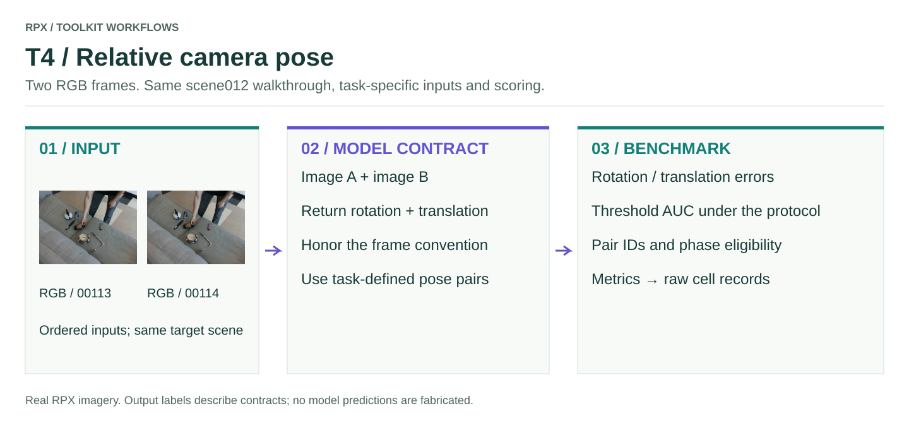

# T4 · Relative camera pose

Two RGB frames → relative `3 × 3` rotation and `3`-vector translation in the declared coordinate convention.

<figure class="rpx-workflow-figure"><a href="../../assets/benchmark-t4.svg"></a><figcaption>This figure shows the T4 interface, not a pretrained-model prediction. Open the vector figure to zoom or reuse it.</figcaption></figure>

## Run the offline smoke example

```bash
python -m rpx_benchmark.examples.benchmark_tasks \
  --task T4 --smoke --output results/t4-smoke
```

This runs a tiny synthetic fixture with a toy callable. Use a fresh output directory; no model weights or dataset downloads are required.

## Run your model on RPX

After preparing the task-specific manifest and your `my_model.py` callable:

```bash
python -m rpx_benchmark.examples.benchmark_tasks \
  --task T4 --manifest manifests/T4/hard.json \
  --model my_model:predict_pose --model-name my-model \
  --model-revision exact-checkpoint-or-api-version \
  --output results/my-model/T4 \
  --device cuda --split hard --max-samples 10
```

For an installed Hub manifest, download a supported task split with `download_split`, then pass its returned local JSON path. `max_samples=10` is an integration subset; omit it for the full protocol.

## Adapter and scoring contract

```python
import numpy as np

def predict_pose(rgb_a, rgb_b):
    rotation, translation = model.predict_pair(rgb_a, rgb_b)
    return {'rotation': np.asarray(rotation), 'translation': np.asarray(translation)}
```

The manifest must identify both images and their corresponding pose GT. Camera frame conventions, translation units/direction, timestamps, and eligible phase pairs are protocol choices, not inferred from a model's output. A zero translation can have undefined direction and must not be interpreted as a valid directional estimate.

Use [`pose_pairs`](https://irvlutd.github.io/RPX/toolkit-docs/rpx_benchmark/pose_pairs.html) and [`pose_metrics`](https://irvlutd.github.io/RPX/toolkit-docs/rpx_benchmark/pose_metrics.html) for the full pair selection and threshold AUC definitions. The generic smoke runner checks the adapter/reporting boundary; reproducing paper results requires the corresponding pair protocol.

## Check before a full benchmark

Verify units and shapes, input ordering, frame/object/sample IDs, and that every requested prediction is accounted for. Load the model once per process, pin its revision, and keep the same data split and preprocessing across comparisons. Real pretrained inference requires that model's environment and weights; the packaged smoke fixture does not replace it.

[All task samples](../README.md) · [Model integration](../../models/README.md) · [Hardware profiler](../../profiling/README.md) · [Φ/JEDI](../../analysis/README.md)
