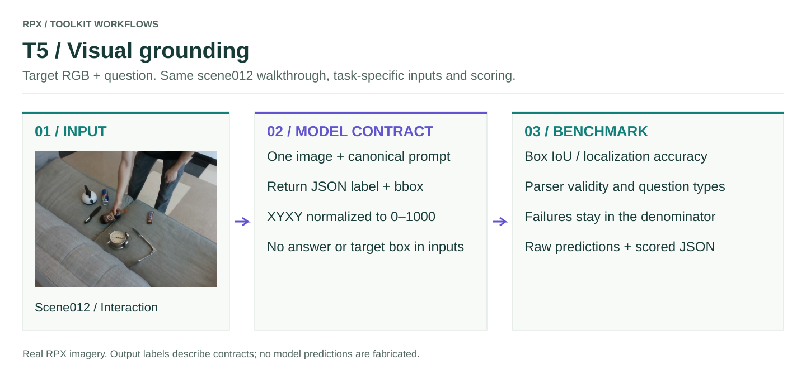

# T5 · Visual grounding

One target image + canonical question → raw text containing a JSON `label` and `bbox`.

<figure class="rpx-workflow-figure"><a href="../../assets/benchmark-t5.svg"></a><figcaption>This figure shows the T5 interface, not a pretrained-model prediction. Open the vector figure to zoom or reuse it.</figcaption></figure>

## Run the offline smoke example

```bash
python -m rpx_benchmark.examples.benchmark_tasks \
  --task T5 --smoke --output results/t5-smoke
```

This runs a tiny synthetic fixture with a toy callable. Use a fresh output directory; no model weights or dataset downloads are required.

## Run your model on RPX

After preparing the task-specific manifest and your `my_model.py` callable:

```bash
python -m rpx_benchmark.examples.benchmark_tasks \
  --task T5 --manifest manifests/T5/hard.jsonl \
  --model my_model:predict_vqa --model-name my-model \
  --model-revision exact-checkpoint-or-api-version \
  --output results/my-model/T5 \
  --image-cache .cache/rpx-vqa
```

Every row in the VQA manifest is scored. Select a smaller canonical manifest beforehand for a smoke run. Keep its question, bbox, image locator and reference metadata intact.

## Adapter and scoring contract

```python
def predict_vqa(image_paths, prompt, max_new_tokens, output_kind):
    # One target image; use your own local or API client and image template.
    return client.generate(images=image_paths, prompt=prompt,
                           max_new_tokens=max_new_tokens)
```

The model sees images and the public prompt. Target boxes and GT answers stay inside the evaluator. Box output uses **XYXY normalized to 0–1000**: `{"label":"cup","bbox":[100,200,600,800]}`. Binary questions instead require `yes` or `no`. These numbers illustrate the response schema; they are not scene012 GT.

Scoring includes bbox IoU, localization at IoU thresholds, parser validity and per-question-type diagnostics. Malformed responses and inference exceptions count as failures; dataset-fetch errors abort. Label diagnostics are reported separately from the primary localization score. Request wall time includes API transport when the callable uses an API.

## Check before a full benchmark

Verify units and shapes, input ordering, frame/object/sample IDs, and that every requested prediction is accounted for. Load the model once per process, pin its revision, and keep the same data split and preprocessing across comparisons. Real pretrained inference requires that model's environment and weights; the packaged smoke fixture does not replace it.

[All task samples](../README.md) · [Model integration](../../models/README.md) · [Hardware profiler](../../profiling/README.md) · [Φ/JEDI](../../analysis/README.md)
