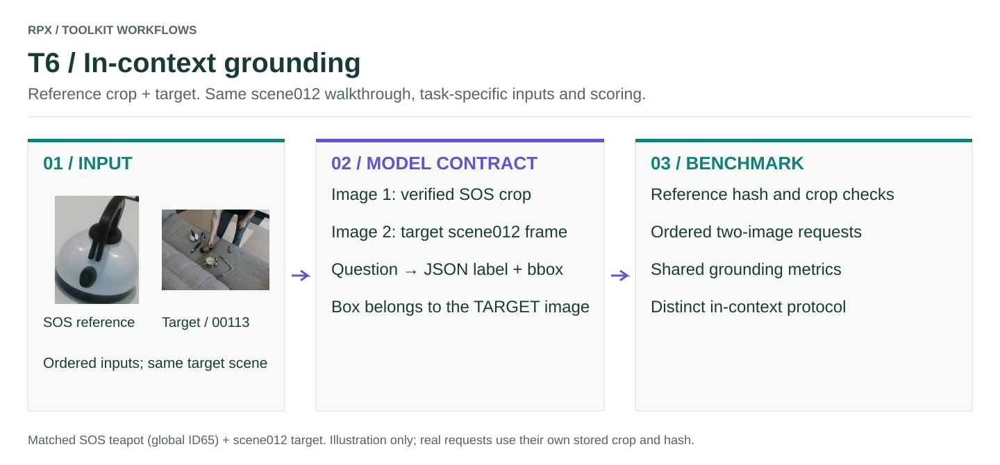

# T6 · In-context grounding

Verified SOS reference crop **first**, target RGB **second**, plus a canonical question → a box in the target image.

<figure class="rpx-workflow-figure"><a href="../../assets/benchmark-t6.svg"></a><figcaption>This figure shows the T6 interface, not a pretrained-model prediction. Open the vector figure to zoom or reuse it.</figcaption></figure>

## Run the offline smoke example

```bash
python -m rpx_benchmark.examples.benchmark_tasks \
  --task T6 --smoke --output results/t6-smoke
```

This runs a tiny synthetic fixture with a toy callable. Use a fresh output directory; no model weights or dataset downloads are required.

## Run your model on RPX

After preparing the task-specific manifest and your `my_model.py` callable:

```bash
python -m rpx_benchmark.examples.benchmark_tasks \
  --task T6 --manifest manifests/T6/hard.jsonl \
  --model my_model:predict_vqa --model-name my-model \
  --model-revision exact-checkpoint-or-api-version \
  --output results/my-model/T6 \
  --image-cache .cache/rpx-vqa
```

Every row in the VQA manifest is scored. Select a smaller canonical manifest beforehand for a smoke run. Keep its question, bbox, image locator and reference metadata intact.

## Adapter and scoring contract

```python
def predict_vqa(image_paths, prompt, max_new_tokens, output_kind):
    assert len(image_paths) == 2  # verified reference, then target
    return client.generate(images=image_paths, prompt=prompt,
                           max_new_tokens=max_new_tokens)
```

Use a canonical **in-context** JSONL manifest. The evaluator reconstructs the SOS crop using the stored inclusive crop box and verifies its SHA256. It preserves the manifest's immutable reference and target revisions. Do not substitute a full SOS frame, an unrelated reference object, or swap the two images.

The returned box uses XYXY normalized to 0–1000 in the **target** image. The same localization parser and metrics as T5 apply, with the in-context question types and two-image inputs. A one-image/text-only endpoint cannot satisfy this task. The SOS reference is the necessary exception to the common scene012 target walkthrough.

## Check before a full benchmark

Verify units and shapes, input ordering, frame/object/sample IDs, and that every requested prediction is accounted for. Load the model once per process, pin its revision, and keep the same data split and preprocessing across comparisons. Real pretrained inference requires that model's environment and weights; the packaged smoke fixture does not replace it.

[All task samples](../README.md) · [Model integration](../../models/README.md) · [Hardware profiler](../../profiling/README.md) · [Φ/JEDI](../../analysis/README.md)
