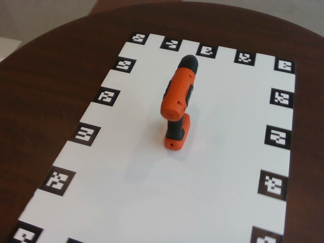
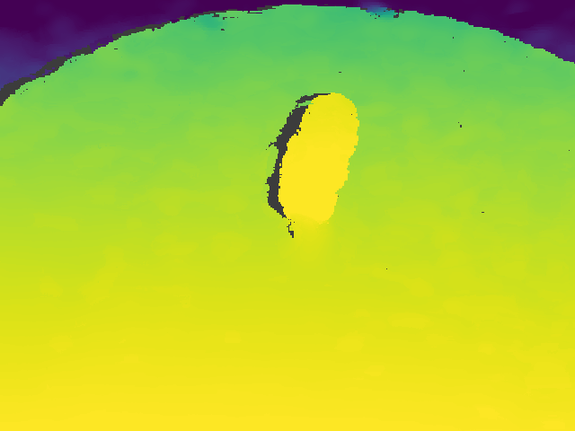
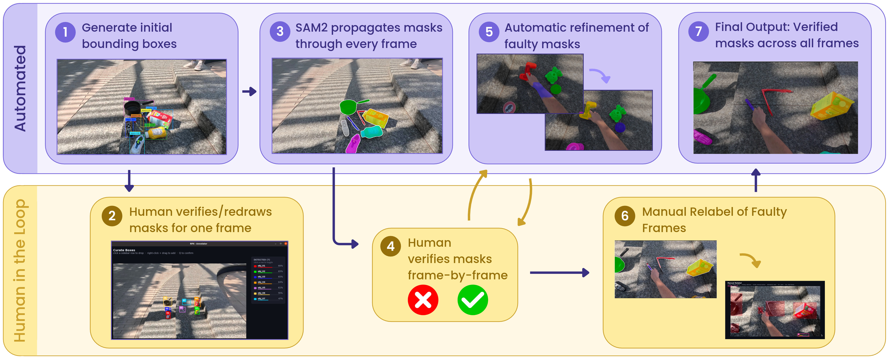
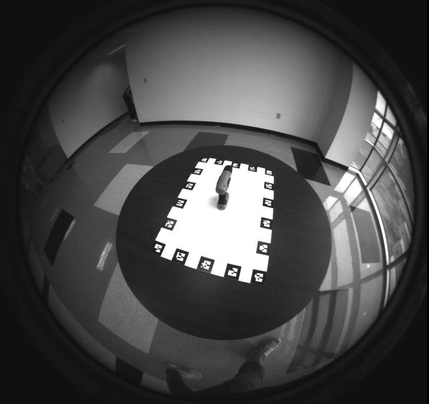
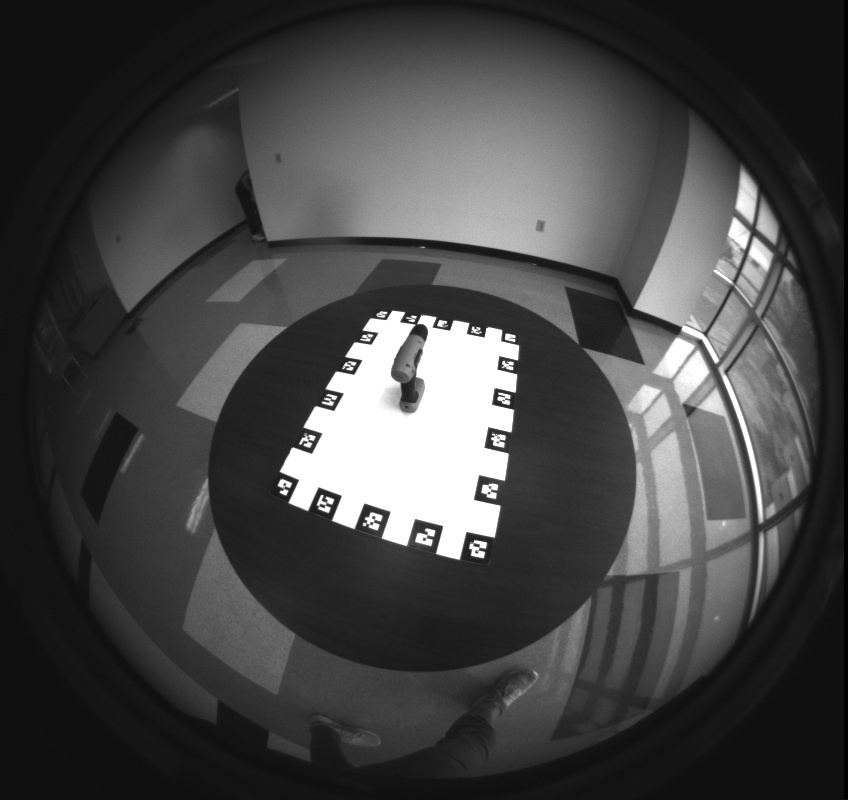

# Data and annotations

RPX follows the same objects across scene phases. Its inputs and annotations support several perception tasks on shared captures, rather than unrelated task datasets.

## Capture views

Exocentric Clutter, Interaction, and Clean provide RGB-D, masks, stereo, and pose. Egocentric RGB is captured during Interaction on an independent clock. Do not assume frame-level synchronization between the ego and exo streams.

<figure class="rpx-wide-figure"><figcaption>Scene 091 / Interaction. Instance-mask overlays show the object identities that tracking and grounding rely on.</figcaption></figure>

## Metric depth and instance masks

The RGB and colorized-depth examples below are from a single-object capture. Colorized depth is a display aid; a benchmark must load the metric ground truth and honor its validity rules. Mask values encode instance identities, not depth or confidence.

<figure><figcaption>RGBAppearance</figcaption></figure>
<figure><figcaption>DEPTHMetric geometry, visualized</figcaption></figure>
<figure><figcaption>INSTANCE MASKObject pixels and identity</figcaption></figure>

Masks connect local frame instances to persistent/global identities. The overlays on the [overview](../README.md) make these labels visible; the benchmark consumes the released mask IDs rather than rendered colors.

## How masks are annotated

<figure class="rpx-wide-figure"><figcaption>RPX's existing annotation-pipeline figure. Open the image for the full-resolution labels.</figcaption></figure>

Automatic propagation is combined with human verification and correction. This figure describes dataset annotation, not the inference pipeline of every benchmark model.

## Stereo and pose

<figure><figcaption>LEFTFisheye stereo</figcaption></figure>
<figure><figcaption>RIGHTFisheye stereo</figcaption></figure>

Relative-pose evaluation uses the task-specific image pairing and pose ground-truth protocol. Having a stereo or pose modality in a capture does not by itself define the evaluation split or eligible phase pairs.

## Check a dataset before benchmarking

Verify modality paths, shape, depth units, camera-coordinate conventions, and joins between scene IDs, frame IDs, mask IDs, and object IDs. Use the same versioned split and validity rules across models. The dataset loader and task APIs define how those contracts enter a run.

[Get started](../getting-started/README.md) · [Model integration](../models/README.md) · [Hub API](https://irvlutd.github.io/RPX/toolkit-docs/rpx_benchmark/hub.html)

The images on these pages come from the existing RPX appendix assets. Their source files and hashes are recorded in [asset provenance](../assets/provenance.json).
