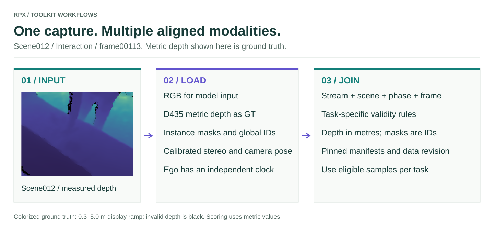
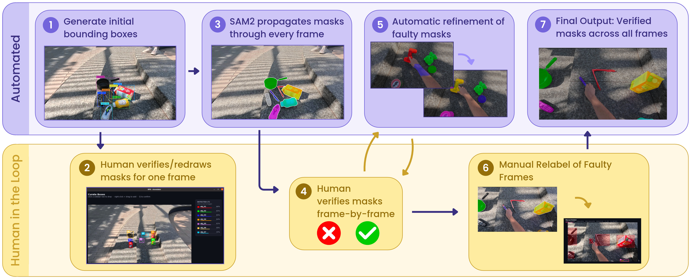

# Data and annotations

<figure class="rpx-workflow-figure"><a href="../assets/data-contract.svg"></a><figcaption>The same scene012 input connects the modality and benchmark guides. Open the vector figure to zoom or reuse it.</figcaption></figure>

RPX follows the same objects across scene phases. Its inputs and annotations support several perception tasks on shared captures, rather than unrelated task datasets.

## Release inventory

The canonical release contains **133,121 frame records**. Count one capture
frame once; RGB, depth, masks and stereo files are modalities of that capture,
not additional frames.

| Stream | Captures | Frames |
| --- | --- | ---: |
| MOS (exocentric) | 100 scenes × 3 phases × 250 frames | 75,000 |
| SOS (single object) | 70 objects × 500 frames | 35,000 |
| Ego | 100 Interaction clips, variable length | 23,121 |
| **Total** | MOS + SOS + Ego | **133,121** |

Use the current release's `manifest/frames_v1.parquet` for frame discovery. The
`hub.fetch_manifest` API loads task-level JSON manifests; download the frame
inventory directly from the dataset Hub: Include the stream identity (`scene_type`) when checking
uniqueness: exocentric and ego frames can share a scene, phase and frame index.
Historical/local manifests can cover fewer ego clips and are not a substitute
for the canonical release inventory.

```python
from huggingface_hub import HfApi, hf_hub_download
import pyarrow.parquet as pq

revision = HfApi().dataset_info('IRVLUTD/RPX', revision='main').sha
path = hf_hub_download('IRVLUTD/RPX', 'manifest/frames_v1.parquet',
                       repo_type='dataset', revision=revision)
frames = pq.read_table(path)
print(revision, frames.num_rows)
```

Record that immutable revision with your benchmark outputs.

## Capture views

Exocentric Clutter, Interaction, and Clean provide RGB-D, masks, stereo, and pose. Egocentric RGB is captured during Interaction on an independent clock. Do not assume frame-level synchronization between the ego and exo streams.

<figure class="rpx-wide-figure"><figcaption>Scene 012 / Interaction. Instance-mask overlays show the object identities that tracking and grounding rely on.</figcaption></figure>

## Metric depth and instance masks

The RGB, colorized depth and instance labels below are from scene012 Interaction frame00113. Colorized depth is a display aid (0.3–5.0 m display ramp; invalid depth is black); a benchmark must load the metric ground truth and honor its validity rules. Mask values encode instance identities, not depth or confidence.

<div class="rpx-modalities rpx-three">
<figure><figcaption><span>RGB</span>Appearance</figcaption></figure>
<figure><figcaption><span>DEPTH</span>Metric geometry, visualized</figcaption></figure>
<figure><figcaption><span>INSTANCE MASK</span>Object pixels and identity</figcaption></figure>
</div>

Masks connect local frame instances to persistent/global identities. The overlays on the [overview](../README.md) make these labels visible; the benchmark consumes the released mask IDs rather than rendered colors.

## How masks are annotated

<figure class="rpx-wide-figure"><a href="../assets/mask-annotation.png"></a><figcaption>RPX's automated and human-in-the-loop mask annotation workflow. Open the image for the full-resolution labels.</figcaption></figure>

Automatic propagation is combined with human verification and correction. This archived annotation-process illustration uses a different scene; the current walkthrough diagrams use scene012. Follow the [mask annotation guide](../annotation/README.md) for tool names, commands, identity checks, and review steps. This figure describes dataset annotation, not the inference pipeline of every benchmark model.

## Stereo and pose

<div class="rpx-modalities">
<figure><figcaption><span>LEFT</span>Fisheye stereo</figcaption></figure>
<figure><figcaption><span>RIGHT</span>Fisheye stereo</figcaption></figure>
</div>

Relative-pose evaluation uses the task-specific image pairing and pose ground-truth protocol. Having a stereo or pose modality in a capture does not by itself define the evaluation split or eligible phase pairs.

## Check a dataset before benchmarking

Verify modality paths, shape, depth units, camera-coordinate conventions, and joins between scene IDs, frame IDs, mask IDs, and object IDs. Use the same versioned split and validity rules across models. The dataset loader and task APIs define how those contracts enter a run.

[Get started](../getting-started/README.md) · [Model integration](../models/README.md) · [Hub API](https://irvlutd.github.io/RPX/toolkit-docs/rpx_benchmark/hub.html)

The images on these pages come from released scene012 captures and existing RPX appendix artwork. Their source files and hashes are recorded in [asset provenance](../assets/provenance.json).
