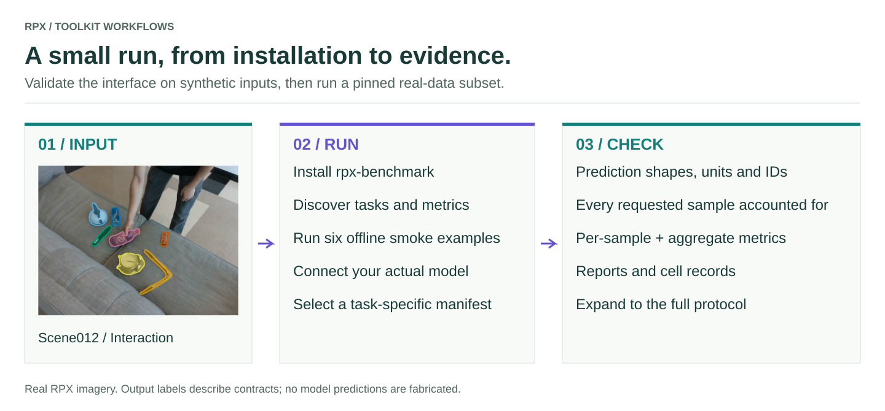

# Get started

<figure class="rpx-workflow-figure"><a href="../assets/getting-started.svg"></a><figcaption>Install, check integration, then connect real models. Open the vector figure to zoom or reuse it.</figcaption></figure>

## 1. Install

```bash
pip install 'rpx-benchmark[hub,schemas]'
```

Python 3.10–3.12. `hub` downloads RPX from Hugging Face; `schemas` validates manifests. Your model's own dependencies
are installed separately.

## 2. Check the install (one second, no downloads)

```bash
python -m rpx_benchmark.examples.benchmark_tasks --task all --smoke --output rpx-check
```

Every task's evaluator runs on tiny synthetic inputs and prints one line per task, T1 to T6. These are integration
checks, not model scores.

## 3. Score your model on real RPX scenes

```python
import numpy as np
import rpx_benchmark as rpx

# Your model: RGB image (H, W, 3) -> metric depth in metres (H, W).
def predict_depth(rgb):
    return np.ones(rgb.shape[:2], np.float32)

model = rpx.make_numpy_depth_model(predict_depth, name="my-depth")
result, report, paths = rpx.run_monocular_depth(rpx.MonocularDepthRunConfig(
    model=model, split="easy", repo_id="IRVLUTD/RPX",
    max_samples=6, output_dir="rpx_results/my-depth",
))
print(result.aggregated["absrel"], result.aggregated["delta1"])
```

Replace `predict_depth` with your model or an API call. The first run fetches about 160 MB, only what this task needs.
Remove `max_samples` to score the whole Easy tier (33 scenes, all three phases). `result.json`, `summary.md` and
per-sample tables land in `output_dir`. The other tasks follow the same pattern: see the
[six task guides](../benchmarks/README.md).

## 4. Get Φ and 𝒥<sub>min</sub>

```bash
python -m rpx_benchmark.examples.summarize_metrics \
  --input rpx_results/my-depth/result.json \
  --metrics absrel rmse silog delta1 --output rpx_results/my-depth/phi.json
```

This prints your model's phase robustness Φ, worst-phase quality 𝒥<sub>min</sub> and quality per phase. Φ needs all three
phases of many scenes, so run a full tier first. See the [Φ and JEDI guide](../analysis/README.md).

## Use a local copy of the data

If RPX is already on disk, point the runner at a task manifest instead of the Hub:

```python
import rpx_benchmark as rpx

# Replace this with your actual model import.
from my_model import predict_depth

model = rpx.make_numpy_depth_model(predict_depth)
cfg = rpx.MonocularDepthRunConfig(
    manifest_path='manifest.json',
    output_dir='results/my-depth-model',
    device='cpu',
    skip_flops=True,
    model=model,
    max_samples=10,
)
result, report, paths = rpx.run_monocular_depth(cfg)
print(result.aggregated)
print(paths)
```

`my_model` is your code, not an installed RPX module. Use `device="cuda"` when your model supports it. Check that the
sample count and scene/phase IDs match your manifest before comparing scores.

## What else is here

```python
from rpx_benchmark.tasks import available_tasks
from rpx_benchmark.metrics import available_metrics

print([task.value for task in available_tasks()])
print(available_metrics())
```

[Connect any model or API](../models/README.md) · [Hardware profiler](../profiling/README.md) ·
[Add a metric](../metrics/README.md) · [Add a task](../tasks/README.md)
