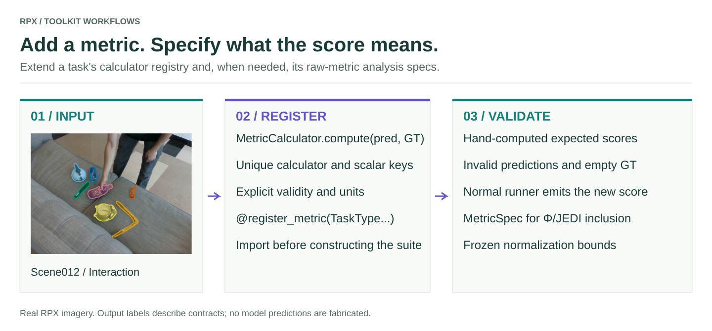

# Add metrics

<figure class="rpx-workflow-figure"><a href="../assets/add-metrics.svg"></a><figcaption>Metric registration, a scoring contract, and hand-computed validation. Open the vector figure to zoom or reuse it.</figcaption></figure>

## Register a calculator

A metric family subclasses `MetricCalculator`. Its `compute(prediction, ground_truth)` returns a dictionary of scalar values. Registration constructs the calculator with no arguments, so use default constructor settings.

The following example computes mean absolute depth error on finite pixels whose GT is within 0.3–5.0 metres. This is an example metric with an explicit validity rule, not a replacement for the paper's depth metrics.

```python
import numpy as np
from rpx_benchmark.api import TaskType, DepthPrediction, DepthGroundTruth
from rpx_benchmark.metrics import (
    MetricCalculator, MetricSuite, register_metric, unregister_metric,
)
from rpx_benchmark.exceptions import MetricError

@register_metric(TaskType.MONOCULAR_DEPTH)
class DepthMAE(MetricCalculator):
    name = 'custom_depth_mae'

    def compute(self, prediction, ground_truth):
        pred = np.asarray(prediction.depth_map)
        gt = np.asarray(ground_truth.depth_map)
        if pred.shape != gt.shape:
            raise MetricError('Prediction and GT shapes differ')
        valid = np.isfinite(gt) & (gt > 0.3) & (gt < 5.0)
        if not valid.any() or not np.isfinite(pred[valid]).all():
            raise MetricError('No valid GT pixels or non-finite prediction')
        return {'custom_depth_mae_m': float(np.abs(pred[valid] - gt[valid]).mean())}

prediction = DepthPrediction(depth_map=np.full((8, 8), 2.5))
ground_truth = DepthGroundTruth(depth_map=np.full((8, 8), 2.0))
suite = MetricSuite.for_task(TaskType.MONOCULAR_DEPTH)
values = suite.evaluate(prediction, ground_truth)
assert values['custom_depth_mae_m'] == 0.5
print(values['custom_depth_mae_m'])

# Remove only this example after the check; leave it registered for your run.
unregister_metric(TaskType.MONOCULAR_DEPTH, 'custom_depth_mae')
```

## Use it in a benchmark

Place the calculator in your own module and import that module before constructing the runner configuration. Registration is process-local; it is not persisted across Python sessions, nor automatically discovered from installed third-party packages.

```python
import my_depth_metrics  # executes @register_metric in your module
from rpx_benchmark.metrics import available_metrics

print(available_metrics())
# Run your normal depth configuration after importing the plugin.
```

The shared task pipeline uses `MetricSuite.for_task(task)` by default. A task configuration can also supply `metric_suite`. The suite evaluates registered calculators and averages numeric per-sample values. Check model-specific standalone scripts separately; a script that bypasses the shared runner may use its own scoring path.

## Metric contracts

- Use unique calculator names and output keys. Later calculators overwrite earlier values with the same output key.
- Return scalar floats, keep units in documentation, and state whether higher or lower is better.
- Raise `MetricError` for malformed inputs; do not silently convert missing predictions into perfect scores.
- Define GT validity, empty-sample behavior, and whether aggregation is per image, scene, object, frame, pair, or question.
- Do not call `clear_registry()` during a real benchmark: it removes built-in metrics too.

There is no supported `MetricSuite(calculators=[...])` constructor or automatic `finalize()` hook. Stateful dataset-level metrics require an explicit aggregation implementation.

## Primary score and paper summaries

Adding a raw metric does not automatically change the primary score, J, or Φ. `TaskSpec.primary_metric` describes the task's primary metric; the task runner must pass a matching key to the pipeline. Paper analysis also has explicit metric vectors, directions, normalization windows, and statistical assumptions. Update those together only when defining a new protocol, and identify the protocol in your reports.

## Tests to include

Use hand-computed perfect and imperfect predictions, malformed shapes, invalid GT, non-finite predictions, and empty-validity cases. Confirm the metric appears in a normal run's per-sample and aggregate outputs. Test independence from registration order when output keys are unique.

[Metric registry API](../api/README.md) · [Add tasks](../tasks/README.md)

## Include a custom score in Φ/JEDI

Register its normalization contract separately from the calculator:

```python
from rpx_benchmark.metrics.specs import MetricSpec, register_spec

register_spec(MetricSpec(
    name='custom_depth_mae_m', direction='lower', best=0.0, worst=1.0,
    theoretical=False, description='Example fixed MAE window in metres',
))
```

The bounds above define an example protocol; they are not paper-calibrated bounds. Explicitly include the new key when calling the [raw-metric calculator](../analysis/README.md), and keep those bounds identical across models.
