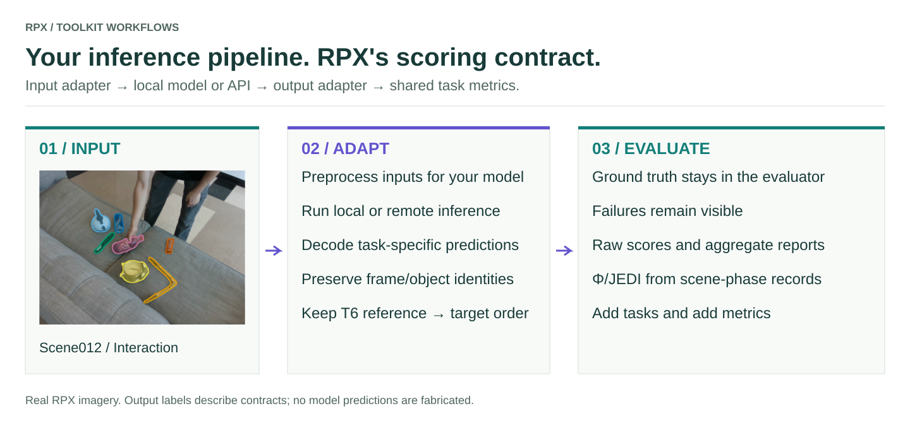

# Bring your own model

<figure class="rpx-workflow-figure"><a href="../assets/bring-your-model.svg"></a><figcaption>Input and output adapters keep your inference pipeline compatible with RPX scoring. Open the vector figure to zoom or reuse it.</figcaption></figure>

## Choose an integration path

| Path | Use it when |
| --- | --- |
| `make_numpy_*_model` | Your callable can accept the task's NumPy inputs and return the expected arrays or dictionaries |
| `BenchmarkableModel` and adapters | You need custom preprocessing, batching, device handling, or output conversion |
| Reference model runners | You want the repository's model-specific benchmark protocol and containers |

Start with `make_numpy_depth_model`, `make_numpy_video_depth_model`, `make_numpy_tracking_model`, or `make_numpy_grounding_model` as appropriate. Their API pages define the exact input and output contracts.

## Local callable

```python
import numpy as np
import rpx_benchmark as rpx

# Runnable integration fixture; this constant prediction is not a real model.
model = rpx.make_numpy_depth_model(
    lambda rgb: np.full(rgb.shape[:2], 2.0, dtype=np.float32)
)
```

## API-backed model

An API client can be wrapped as the same callable. Decode its response into the required prediction format before returning it:

```python
import numpy as np
import rpx_benchmark as rpx

def predict_depth(rgb):
    # Configure authentication outside your source code.
    response = client.predict(rgb)  # your initialized API client
    depth = np.asarray(response['depth_metres'], dtype=np.float32)
    if depth.shape != rgb.shape[:2] or not np.isfinite(depth).all():
        raise ValueError('API returned invalid depth')
    return depth

model = rpx.make_numpy_depth_model(predict_depth)
```

The client and response schema are service-specific. RPX does not create an API endpoint or authenticate a service for you. Configure timeouts and retries in your client, and validate coordinates, units, missing outputs, and sample identity. Keep reference-image inputs for T6; a text-only callable does not establish in-context grounding support.

## Validate before a full run

Run a known synthetic case, then a small real split. Verify output shapes, finite values, IDs, and units. Confirm that all requested samples were evaluated and failed calls are accounted for. Use the same split, preprocessing, and metric settings for every comparison.

[Task API](../api/README.md) · [Add metrics](../metrics/README.md)

## Task-specific callable commands

Use the [six benchmark samples](../benchmarks/README.md) to connect a module/function from an installed wheel. T1–T4 wrap task-specific NumPy callables; T5/T6 use `evaluate_vqa` with canonical prompts, parser, and retained failures. The two-image contract and verified SOS crop are required for T6.

[Tool capabilities](../capabilities/README.md) · [Hardware profiler](../profiling/README.md)
