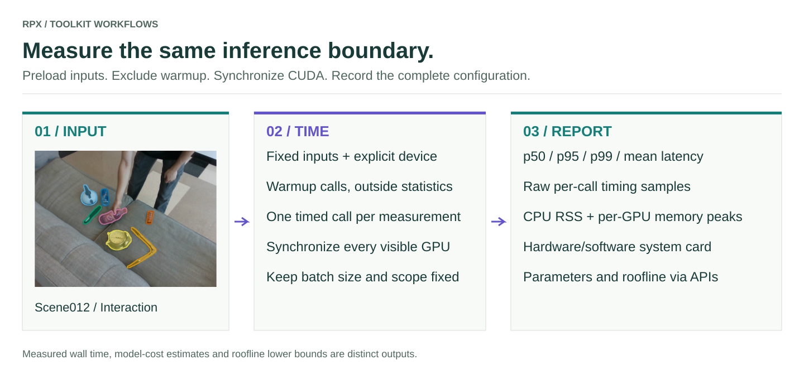

# Hardware profiler

Measure latency and memory at a declared inference boundary, and save the hardware/software configuration alongside every result. The same callable interface can profile frames, clips, image pairs, or API requests.

<figure class="rpx-workflow-figure"><a href="../assets/hardware-profiler.svg"></a><figcaption>The scene012 input remains constant while the measured operation changes by task. Open the vector figure to zoom or reuse it.</figcaption></figure>

## Three kinds of evidence

| Layer | Tools | Meaning |
| --- | --- | --- |
| Model cost | `profile_model`, `ModelProfiler`, `EfficiencyMetadata` | Parameters, supported FLOP counts, estimated memory traffic and derived MACs |
| Hardware-parametric estimate | `GPUSpec`, `RooflineBound` | Ideal compute/memory lower bounds, not measured inference time |
| Measured execution | `LatencyProfiler`, `MemoryProfiler`, `SystemCard` | Wall-time percentiles, memory readings, and hardware/software context |

Unavailable counters remain unavailable. An API does not expose its remote GPU memory or parameter count merely because its request latency is measured.

## A runnable CPU example

The following command profiles the packaged synthetic depth callable, **not pretrained inference**. It checks installation and report generation without a GPU or model download.

```bash
python - <<'PYINPUT'
import numpy as np
np.savez('profile-inputs.npz', rgb=np.full((480, 640, 3), 128, np.uint8))
PYINPUT
python -m rpx_benchmark.examples.profile_callable \
  --model rpx_benchmark.examples.benchmark_tasks:demo_depth \
  --inputs profile-inputs.npz --device cpu --precision fp32 \
  --unit frame --warmup 10 --repeats 1000 --output profile-demo.json
```

## Profile your real model

Create `my_model.py` with a callable `predict_depth(rgb)` that loads its model once, places it on the selected GPU, and includes the preprocessing/postprocessing you intend to time. NPZ key names become keyword arguments. For a pair model use keys `rgb_a`, `rgb_b`; for a clip model use the keyword your callable accepts.

```bash
CUDA_VISIBLE_DEVICES=0 python -m rpx_benchmark.examples.profile_callable \
  --model my_model:predict_depth --inputs profile-inputs.npz \
  --device cuda --precision fp16 --unit frame \
  --warmup 10 --repeats 1000 --output results/my-model/profile.json
```

`--precision` records the precision; it does **not** cast or configure your model. The callable controls placement, inference mode, generation limits, and autocast. CUDA must actually be available when requested; the profiler refuses CPU fallback. It synchronizes **all visible CUDA devices** before and after each call. For a required two-GPU model set `CUDA_VISIBLE_DEVICES=0,1` and record that configuration consistently.

Fixed-input `--repeats 1000` means **1,000 timed calls**, not 1,000 distinct dataset samples. Use representative inputs and the same timing scope across models. Record clip length or question/token budgets in addition to the image dimensions. Run exclusive workloads on the measured GPUs to make comparisons interpretable.

## Read the JSON

`latency` contains p50, p95, p99 and mean in milliseconds. `latency_samples_ms` preserves every measured call; warmup calls are excluded. `inputs` records each NPZ array's shape and dtype. `system_card` records the detected hardware/software and declared precision.

`memory.cpu_process_lifetime_peak_mb` is process high-water RSS and includes setup; it is not isolated incremental inference memory. CUDA values are per-device PyTorch allocator peaks after warmup, including already-resident weights; they are not total board usage or a measurement of every non-PyTorch allocation. CPU profiling can also time an API callable, but its time includes transport and server execution while memory is local-client memory.

## Use the profiler APIs in a runner

```python
from rpx_benchmark.profiler import LatencyProfiler

latency = LatencyProfiler(warmup=0)
latency.add_sample_seconds(0.010)
latency.add_sample_seconds(0.020)
assert latency.percentiles()['p50_ms'] == 15.0
```

Use [`ModelProfiler`](https://irvlutd.github.io/RPX/toolkit-docs/rpx_benchmark/model_profiler.html#ModelProfiler) to prepare cost metadata and build a `ProfileReport` from runner-populated efficiency measurements. Use [`profile_model`](https://irvlutd.github.io/RPX/toolkit-docs/rpx_benchmark/profiler.html#profile_model) for supported standalone PyTorch cost estimates. FLOP counting is model/input dependent; unknown values must not be filled with zero.

For the repository's pretrained depth roster, [`profile_depth_efficiency.py`](https://github.com/IRVLUTD/RPX/blob/main/benchmark/scripts/profile_depth_efficiency.py) profiles staged task manifests with model-specific loading and input checks; [`aggregate_depth_efficiency.py`](https://github.com/IRVLUTD/RPX/blob/main/benchmark/scripts/aggregate_depth_efficiency.py) validates and combines those reports.

[Task benchmarks](../benchmarks/README.md) · [Profiler API](https://irvlutd.github.io/RPX/toolkit-docs/rpx_benchmark/profiler.html) · [Citation](../citation/README.md)
