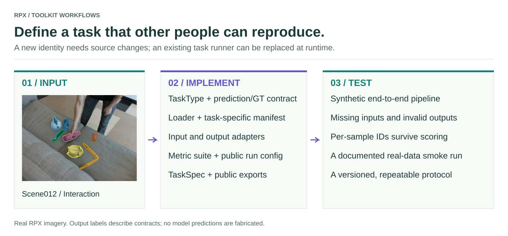

# Add tasks

<figure class="rpx-workflow-figure"><a href="../assets/add-tasks.svg"></a><figcaption>Task contracts connect loaders, adapters, scoring and reporting. Open the vector figure to zoom or reuse it.</figcaption></figure>

## Runtime extension versus a new task identity

The current public task identities are members of `TaskType`, a fixed enum. You can register a new metric or replace the runner for an existing identity at runtime. A completely new identity requires a toolkit source change; an arbitrary string is not a supported replacement for `TaskType` in the metric registration API.

## Register a runner for an existing task

This runnable example temporarily replaces the image-depth runner with a wrapper, while preserving the existing metric, modalities, and hooks. It restores the original registration afterwards.

```python
from dataclasses import replace
from rpx_benchmark.api import TaskType
from rpx_benchmark.tasks.registry import (
    get_task_spec, register_task, unregister_task,
)

task = TaskType.MONOCULAR_DEPTH
original = get_task_spec(task)

def custom_run(cfg):
    # Add your run setup here, then delegate to the existing pipeline.
    return original.run(cfg)

unregister_task(task)
try:
    custom = replace(original, display_name='Custom depth protocol', run=custom_run)
    register_task(custom)
    assert get_task_spec(task).run is custom_run
    # Invoke get_task_spec(task).run(your_config) to use the replacement.
finally:
    unregister_task(task)
    register_task(original)
```

Registration rejects duplicate task identities. `get_task_spec(task).run(cfg)` dispatches through the registry; calling a named built-in function directly continues to invoke that function.

## Implement a completely new task

Work in a source checkout and install it with `pip install -e './benchmark[dev]'`.

1. **Define the contract in `rpx_benchmark/api.py`.** Add a `TaskType` member and prediction/GT dataclasses. Specify units, coordinates, shape, valid values, and sample identity.
2. **Teach the loader the GT format.** Update `loader.py` or the relevant video loader and manifest validation. Keep modality selection and IDs consistent with the dataset release. Adding an enum member alone does not make manifests loadable.
3. **Implement the adapter.** Add input preparation and prediction conversion under `adapters/`. Expose a `make_numpy_*_model` helper if a callable interface is useful.
4. **Implement scoring.** Add a `MetricCalculator` under `metrics/`, register it with the new enum member, and import its module in `metrics/__init__.py` so it registers at import time.
5. **Implement the runner.** Add a task config and a `run_*` callable under `tasks/`. Reuse `run_pipeline` where its input, output, and aggregation assumptions fit. Sequence or dataset-level tasks may need a specialized runner.
6. **Register and expose it.** Create a `TaskSpec`, import the task module in `tasks/__init__.py`, and export the public config and runner from `rpx_benchmark/__init__.py`.
7. **Update reports and protocol metadata.** Check task names, required modalities, primary metric direction, cell records, split handling, and any explicit dispatch in hub downloads or scripts. Register temporal/geometric hooks only when their assumptions hold.
8. **Test and document it.** Add synthetic loader, adapter, metric, and end-to-end tests. Include the new task in task parity and public workflow coverage, then validate a small real-data run.

## TaskSpec contract

| Field | Requirement |
| --- | --- |
| `task` | The new `TaskType` enum member |
| `display_name`, `description` | User-facing task definition |
| `primary_metric` | A scalar key emitted by scoring and used by your runner |
| `higher_is_better` | Direction of the primary score |
| `required_modalities` | Dataset modalities the task consumes |
| `run` | `(cfg) → (BenchmarkResult, optional deployment report, paths)` |
| Optional hooks | Explicit temporal stability and geometric coherence functions |

Use `tasks/monocular_depth.py` as a small pipeline example and `tasks/video_depth.py` for sequence-specific behavior. These modules show how registration, scoring, and configuration connect; copying their names without adapting their assumptions is insufficient.

## Acceptance checks

A new task is ready when its GT loader and prediction adapter agree, hand-computed scores match, the registered runner writes per-sample and aggregate outputs, sample IDs survive the entire pipeline, and the documented example runs from an installed wheel. Test missing modalities and invalid predictions as well as successful inference.

[Task registry API](../api/README.md) · [Add metrics](../metrics/README.md)
