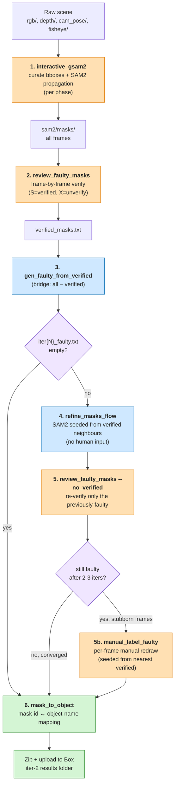

# `data/mask_annotation/` — Ground-truth mask generation

> Interactive **GroundingDINO + SAM2** pipeline that turns a captured RPX
> scene into per-frame instance masks. A human operator curates bboxes
> on one keyframe per phase; **SAM2 propagates** to every other frame.

> [!IMPORTANT]
> **Most users do not need this directory.** Mask generation is how
> the RPX ground truth was *created*. To *benchmark* a model against
> the already-published RPX dataset (which already has masks),
> use [`../benchmark/`](../benchmark/README.md) instead. You only
> come here if you're producing GT masks for newly captured scenes,
> on a CUDA-capable annotation box.

**What it does.** Per-frame instance masks are required ground truth
for the benchmark, and labelling them by hand is impractical at RPX
scale. The pipeline uses GroundingDINO to suggest open-vocabulary
bounding boxes on one keyframe per phase, SAM2 to turn each curated
box into a pixel-accurate mask, and SAM2's temporal propagation to
extend that mask through every remaining frame in the phase. A human
reviews one keyframe per phase per scene; the rest is automatic.

---

## 🗺️ Pipeline at a glance



Legend: 🟧 human-in-the-loop · 🟦 fully automatic · 🟪 decision · 🟩 terminal step.

Most scenes converge after iter 1 → review → iter 2 → re-review. The
manual-labeling step (5b) is only needed for the handful of frames where
SAM2 propagation keeps disagreeing with the verified neighbours.

---

## ⚡ Quick start

```bash
# 0. One-time setup (conda env with CUDA + the RoboKit library)
export CUDA_HOME=/usr/local/cuda-12.6/
conda create -n rkit-rpx python=3.9 && conda activate rkit-rpx
pip install -r requirements.txt
conda install pytorch torchvision torchaudio pytorch-cuda -c pytorch -c nvidia

# 1. Pull one scene's raw captures from Box
#    → https://utdallas.box.com/s/saifhadoad3w136tbvfgcrd4n2zk8e7t

# 2. ITERATION 1 — first-pass mask generation (per phase)
#    Opens a 2-step UI: (a) curate GroundingDINO boxes, (b) refine sizes
#    one-by-one. SAM2 then propagates backward through every frame.
python -m maskgen_pipeline.interactive_gsam2 --scene_dir <scene_dir>/0
python -m maskgen_pipeline.interactive_gsam2 --scene_dir <scene_dir>/1
python -m maskgen_pipeline.interactive_gsam2 --scene_dir <scene_dir>/2

# 3. RECHECK / VERIFY — step through the generated masks frame-by-frame.
#    Pass --base_dir at the SCENE level → reviews all 3 phases in one pass.
#    Keys: S = save & next, Q = save & exit, X = unverify,
#          ← / → = skip without saving, T = toggle contours, P = pub mode.
python -m maskgen_pipeline.review_faulty_masks --base_dir <scene_dir>

# 4a. Bridge — turn the reviewer's "verified" list into the refiner's
#     "faulty" list (per phase that has any faulty frames).
python -m maskgen_pipeline.gen_faulty_from_verified --scene_dir <scene_dir>/0 --iter 1
python -m maskgen_pipeline.gen_faulty_from_verified --scene_dir <scene_dir>/1 --iter 1
python -m maskgen_pipeline.gen_faulty_from_verified --scene_dir <scene_dir>/2 --iter 1

# 4b. ITERATION 2 — automatic refinement of faulty frames flagged above.
#     No human input — fully automatic. Skip a phase if 4a wrote 0 faulty.
python -m maskgen_pipeline.refine_masks_flow --scene_dir <scene_dir>/0 --iter 1
python -m maskgen_pipeline.refine_masks_flow --scene_dir <scene_dir>/1 --iter 1

# 5. Re-verify the refined frames (only the previously-faulty ones).
#    --no_verified skips the frames you already marked good.
python -m maskgen_pipeline.review_faulty_masks --scene_dir <scene_dir> --no_verified

# 5b. (Fallback — only if a handful of frames stay faulty after 2-3 iters.)
#     Per-frame manual labeling: seeds bboxes from the nearest verified frame
#     so object IDs stay consistent, then you redraw / add / delete by hand.
python -m maskgen_pipeline.manual_label_faulty --scene_dir <scene_dir>/<phase> --iter 2

# 6. Map mask IDs ↔ object names (one click per object id, per scene).
python -m visual_grounding_gt.mask_to_object \
        --scene_dir <scene_dir> --json visual_grounding_gt/scenes_test.json

# 7. Zip + upload to the iter-2 results folder on Box.
```

Output layout (consumed directly by `rpx_benchmark`):

```
<scene_dir>/<phase>/sam2/masks/<frame>.png      # int16 per-instance ID map
<scene_dir>/<phase>/sam2/labels/...             # GroundingDINO label artefacts
```

---

## 🧱 The two-stage pipeline

### Iteration 1 — interactive bbox curation + SAM2 propagation

```bash
python -m maskgen_pipeline.interactive_gsam2 --scene_dir <scene_dir>/<phase>
```

The pipeline goes through **three steps**, all in matplotlib windows:

**Step 1 — Curate Boxes.** A window opens showing the **last frame** of
the phase with GroundingDINO-suggested bounding boxes overlaid. The
right-hand sidebar lists each detected object with a color swatch,
`obj_NN` label, confidence percentage, and a mini confidence bar. Boxes
are sorted by confidence (most-confident at the top).

| Action | Effect |
|---|---|
| **Click a sidebar row** | Toggle keep / drop — dropped rows go strikethrough + dim |
| **Right-click + drag in the image** | Add a new bounding box |
| **Q / Enter** | Confirm the curated set, advance to Step 2 |
| **Esc** | Cancel |

**Step 2 — Refine Sizes** (one-by-one, single window). Each kept box
is highlighted in brand pink in turn; the others are dimmed. Drag to
redraw the active box, then advance to the next.

| Action | Effect |
|---|---|
| **L-click + drag** | Redraw the active box |
| **Q / Enter / N / →** | Confirm this box, advance to the next |
| **← / P** | Back to the previous box |
| **Esc** | Skip remaining boxes — keep edits made so far |

After the **last** box the window closes automatically.

**Step 3 — SAM2 propagation.** No UI. SAM2 propagates the confirmed
boxes backward through every frame in the phase and writes per-frame
instance masks to `sam2/masks/<frame>.png` (uint16, one ID per object).

### Recheck / Verify generated masks

```bash
# Review all 3 phases of a scene in one pass:
python -m maskgen_pipeline.review_faulty_masks --base_dir <scene_dir>

# Or review just one phase:
python -m maskgen_pipeline.review_faulty_masks --base_dir <scene_dir>/<phase>
```

`--base_dir` accepts either the scene directory (all phases scanned) or a
single phase directory. Two on-disk layouts are auto-detected:
the legacy multi-scene archive (`<scene>/sam2/<phase>/contour_gt_masks/…`)
and `interactive_gsam2`'s direct output (`<scene>/<phase>/sam2/contour_gt_masks/…`).

Steps through the generated masks frame-by-frame so you can decide which
are good (mark verified) and which need a refinement pass.

| Key | Action |
|---|---|
| **S** | Save current frame as verified, advance to next |
| **Q** | Save current frame, exit the reviewer |
| **X** | Un-verify (remove from verified set), reload frame |
| **T** | Toggle contour overlay on/off |
| **P** | Publication mode — hide the UI panel for screenshots |
| **←  /  →** | Skip backward / forward without saving |
| **Esc** | Exit WITHOUT saving the current frame |

A bottom panel exposes per-instance hide/unhide buttons so you can isolate
one object at a time. Frames not marked verified are picked up by
Iteration 2's automatic refinement.

### Bridge — turn the reviewer's "verified" list into the refiner's "faulty" list

The reviewer writes a *verified* set; the refiner expects a *faulty* set.
This one-step bridge computes ``all_masks ∖ verified`` and writes the
file the refiner is looking for:

```bash
python -m maskgen_pipeline.gen_faulty_from_verified --scene_dir <scene_dir>/<phase> --iter 1
```

Output: ``<scene_dir>/<phase>/sam2/iter1_faulty.txt`` containing one
integer frame id per line. Stdout reports how many faulty frames were
found — if it prints ``0 faulty``, skip the refiner for that phase.

Repeat per phase. Bump ``--iter`` for subsequent rounds (``--iter 2``,
``3``, ...).

### Iteration 2 — automatic refinement of faulty frames

Faulty frames flagged in iter 1 get a second pass. **No human input** —
fully automatic. Skip this on any phase that has zero faulty frames.

```bash
python -m maskgen_pipeline.refine_masks_flow --scene_dir <scene_dir>/<phase> --iter 1
```

The refiner seeds SAM2 from the closest *verified* neighbour on each side
of a faulty run and propagates inward, meeting in the middle. Output
goes to ``<scene_dir>/<phase>/sam2/mask_refinement/iter_1/`` and the
top-level ``sam2/masks/`` is updated in place.

Re-verify the refined frames with the reviewer — **pass `--no_verified`**
so it skips the already-marked frames and only stops on the previously-
faulty ones:

```bash
python -m maskgen_pipeline.review_faulty_masks --scene_dir <scene_dir> --no_verified
```

(`--scene_dir` and `--base_dir` are aliases on the reviewer.)

If anything is still wrong, repeat: bridge → refine → re-verify with
incrementing ``--iter`` until convergence. Most scenes converge after 1–2
refinement rounds.

### Fallback — manual per-frame labeling for stubborn frames

When SAM2 propagation keeps disagreeing with the verified neighbours on
the same handful of frames (typically motion-blur, occlusion, or a new
object entering the scene), drop into this tool to fix them by hand.
It seeds bboxes from the nearest verified frame so object IDs stay
consistent across the phase.

```bash
python -m maskgen_pipeline.manual_label_faulty --scene_dir <scene_dir>/<phase> --iter 2
```

`--iter N` reads `iter{N}_faulty.txt`. Omit `--iter` to process every
frame in `sam2/masks/` that isn't already in `masks_verified/`.

| Action | Effect |
|---|---|
| **L-click + drag** | Redraw the active bbox |
| **R-click + drag** | Add a new bbox (gets next available object ID) |
| **D / Delete / Backspace** | Remove the active bbox |
| **Q / Enter / N / →** | Confirm this box, advance to the next |
| **← / P** | Back to the previous box |
| **Esc** | Skip remaining boxes on this frame |

After confirming all bboxes on a frame, SAM2's *image* predictor runs on
each box and the combined per-instance mask is written to all four
output dirs (`masks/`, `palette/`, `rgb_and_mask/`, `contour_gt_masks/`)
plus `masks_verified/`, so the next `--no_verified` review skips it and
`gen_faulty_from_verified` no longer flags it.

### Final step — object-ID mapping

Once masks look right across all three phases, link mask IDs to object
names (one click per id, per scene):

```bash
python -m visual_grounding_gt.mask_to_object \
        --scene_dir <scene_dir> --json visual_grounding_gt/scenes_test.json
```

---

## 📂 What each script does

| Script | Purpose |
|---|---|
| `maskgen_pipeline/interactive_gsam2.py` | **Iter 1.** Interactive bbox curation + SAM2 propagation. |
| `maskgen_pipeline/interactive_gsam2_rdd_refinement.py` | Variant using RDD (Robust Deformable Detector) for tighter bboxes on small objects. |
| `maskgen_pipeline/interactive_gsam2_refine_pp_1.py` | Refinement variant: bbox-then-point-prompt on faulty frames. |
| `maskgen_pipeline/refine_masks.py` / `refine_masks_flow.py` | **Iter 2.** Automatic refinement of faulty frames (no UI). |
| `maskgen_pipeline/review_faulty_masks.py` | Visualize generated masks; tag faulty frames for the next iter. |
| `maskgen_pipeline/gen_faulty_from_verified.py` | **Bridge.** Turn `verified_masks.txt` (reviewer output) into `iter{N}_faulty.txt` (refiner input). |
| `maskgen_pipeline/manual_label_faulty.py` | **Fallback.** Per-frame manual bbox labeling for frames that auto-refinement keeps getting wrong; SAM2 image-predictor builds the mask from the bboxes. |
| `maskgen_pipeline/review_faulty_bboxes.py` | Same idea, but on raw bboxes (pre-SAM2). |
| `maskgen_pipeline/propagate_bboxes.py` | Standalone bbox-propagation step (used internally by the interactive tools). |
| `maskgen_pipeline/collect_faulty_and_gdino_bboxed_headless.py` | Headless variant: enumerate faulty frames + pre-compute GroundingDINO bboxes. |
| `maskgen_pipeline/run_sam2_from_verified_bboxes.py` | Re-run SAM2 from a verified bbox set (skip the interactive curation). |
| `maskgen_pipeline/point_prompts_via_rdd.py` | Generate point prompts using RDD correspondences. |
| `maskgen_pipeline/pds_frames_filter.py` | Poisson-disk frame filter to thin a long capture to a representative subset. |
| `maskgen_pipeline/test_sam2_point_prompts.py` | Standalone SAM2 point-prompt smoke test. |
| `maskgen_pipeline/bbox_prompts_overlay.py`, `collect_bbox_prompts.py` | Bbox utilities re-used by the interactive UIs. |
| `maskgen_pipeline/mask_refinement_tools/mask_to_bbox_refinement.py` | Optional follow-up: refine bboxes back from a verified mask. |
| `visual_grounding_gt/mask_to_object.py` | One-click mask-id ↔ object-name mapping (final step). |
| `visual_grounding_gt/correspondence_validation_viz.py` | Visual sanity check on the id mapping. |

The inner `robokit/` directory is the [IRVLUTD/robokit](https://github.com/IRVLUTD/robokit)
Python library — perception primitives, dataset adapters, evaluation
metrics. It's imported as `from robokit.perception import …` from
every pipeline script.

---

## 🐳 Docker

Ubuntu 20.04 + ROS Noetic + CUDA 11.8 + Gazebo 11. Useful when the
host environment is dirty.

```bash
cd docker
./run_container.sh
```

The image is built off
[`Dockerfile-ub20.04-ros-noetic-cuda11.8-gazebo`](docker/Dockerfile-ub20.04-ros-noetic-cuda11.8-gazebo).

---

## 🔗 Acknowledgments

The interactive pipeline is built on top of several upstream projects.
**License compatibility is mandatory — check each before redistributing.**

- [SAM2](https://github.com/facebookresearch/sam2) — Meta's Segment
  Anything v2; bbox-and-point → mask + temporal propagation.
- [GroundingDINO](https://github.com/IDEA-Research/GroundingDINO) —
  IDEA-Research's open-vocabulary bbox suggester.
- [RoboKit](https://github.com/IRVLUTD/robokit) — IRVL UTD's perception
  toolkit; vendored as `data/mask_annotation/robokit/`.
- [BundleSDF](https://github.com/NVlabs/BundleSDF) — NVIDIA's
  reference docker setup, used as a base for ours.
- [iTeach-DHYOLO](https://huggingface.co/spaces/IRVLUTD/DH-YOLO),
  [DepthAnything](https://huggingface.co/docs/transformers/main/en/model_doc/depth_anything),
  [FeatUp](https://github.com/mhamilton723/FeatUp),
  [CLIP](https://github.com/openai/CLIP) — additional zero-shot
  perception primitives available in the inner `robokit/` library.

## License

MIT, matching the rest of the RPX repo. Upstream-licence compatibility
is the user's responsibility.
